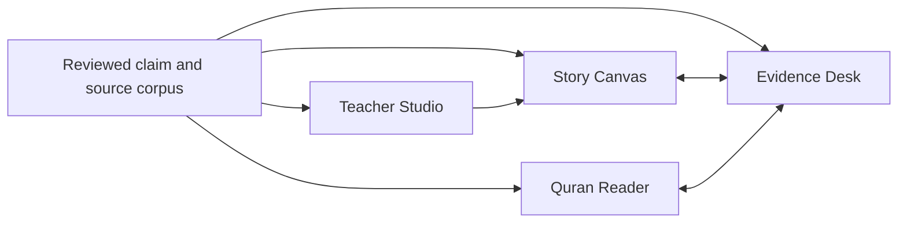

# Design Direction

## Quranic Narrative and Evidence Atlas

**Status:** competitor teardown complete ? founding decisions applied  
**Companion documents:** [Strategy](./QURAN_PRODUCT_STRATEGY.md) ? [Product roadmap](./ROADMAP.md) ? [Open resources catalog](./OPEN_RESOURCES_CATALOG.md) ? [Resource intake system](./RESOURCE_INTAKE_SYSTEM.md)

**Design goal:** a calm, modern atlas and research publication that makes dense Quranic knowledge easier to understand without making uncertain material look certain.

This is an original design system informed by a live audit of current products. It does not reuse a competitor?s branding, illustrations, screenshots, or proprietary interface.

---

## 1. North star

The interface should feel like a meeting point between:

- a beautifully typeset mushaf reader;
- a museum-quality story atlas;
- a primary-source research workbench;
- an excellent teacher?s lesson board.

It should not feel like:

- a dark ?luxury Islamic? landing page covered in gold;
- an ordinary article blog with generic Quran photographs;
- a neon analytics dashboard;
- a wall of identical cards;
- a giant unlabeled network graph;
- a cinematic retelling that invents what the sources do not state.

The design promise is:

> Quiet at first glance, deep on demand, and transparent at every claim.

---

## 2. What the competitor audit changes

The following findings refer to pages as inspected during the coverage audit. Competitor products change; re-walk before relying on any row.

| Product and page | Keep | Do differently |
|---|---|---|
| [Quran.com reader](https://quran.com/12) | Spacious verse treatment, familiar controls, strong language support | Keep research prompts non-interruptive; make tafsir and annotations claim-aware rather than opening only long, undifferentiated prose |
| [Quran.com Explore](https://quran.com/en/explore) and [Prophet Salih](https://quran.com/explore/prophet-salih) | Simple, approachable discovery cards and clean Quran passages | Add filters, story reconstruction, people, places, evidence, maps, teaching formats, and source status; the inspected Salih page was essentially a title plus two Quran passage groups |
| [Sadaa](https://sadaa.me/en/) | The valuable choice between guided thematic navigation and a visual explorer | Do not block first use with onboarding; make categories resolve into composed dossiers rather than one-verse-at-a-time browsing |
| Sadaa Explorer | Memorable thematic overview | Label every relationship with a verb, show its evidence, raise contrast, support semantic zoom, and complete localization QA |
| [Quran Companion timeline](https://quran-companion.co/timeline) | Coherent visual identity, useful filters, readable event cards | Do not give uncertain ancient events a precise-looking date without source, range, alternatives, and methodology; avoid an endless single-column accordion |
| Quran Companion parallel viewer | The right idea: compare one narrative across surahs | Show the actual ayat in synchronized columns; stack the interface deliberately on mobile instead of clipping a desktop split view |
| [Quranic Arabic Corpus ontology](https://corpus.quran.com/ontology.jsp) | Structured concepts, occurrences, named entities, and relations | Preserve the data value while replacing the fixed legacy graph with an event- and evidence-aware, responsive interface |
| [Qissah?s Yusuf story](https://qissahapp.com/stories/prophet-yusuf) | Friendly long-form storytelling, quick introduction, and lesson framing | Add a graphical story path, passage comparison, evidence next to each non-Quranic name/date/detail, and visible status for weak or disputed material |
| [Tawarikh](https://www.tawarikh.app/) | Story beats, event dossiers, chronology, search, and qualified place language | Attach confidence to individual claims?not a whole mixed-evidence event?and put evidence next to the statement instead of only at the bottom |
| [AlTafsir](https://www.altafsir.com/Index.asp) and [IslamOne](https://islamone.app/) | Source breadth and Urdu depth | Turn collections into a connected evidence layer behind stories, rather than making readers navigate each library separately |

### The open design space

Every strong product audited centers a different object: ayah, theme, story, event, concept, or source collection. This product should center the **auditable claim**, then let the reader see that claim inside a story, ayah, hadith, tafsir position, person, place, event, historical hypothesis, or scientific comparison.

---

## 2b. Live layout teardown

The coverage audit above recorded *what each product covers*. This pass walked the actual rendered pages to record *how the information is laid out*, because that is where the failures are. Findings below are from pages as inspected; re-walk before relying on them.

### Quran.com verse view ? [/al-kahf/9-26](https://quran.com/en/al-kahf/9-26)

The single most-used Quran interface in the world, and the layout tells you exactly what it is optimized for.

What the page actually renders per ayah: an action row of six controls (play, bookmark, copy, share, note, more), the Arabic in two encodings, a word-by-word row where **every single word is an interactive popover button**, the English translation, the Urdu translation, and then four collapsed buttons ? *Tafsirs*, *Lessons*, *Reflections*, *Related Content*.

- **The interpretive layer is four closed doors.** Everything that explains the passage sits behind an unlabeled toggle. Nothing on the surface tells you whether a tafsir even exists for this ayah, how many there are, or whether they disagree. The reader must click to discover there is nothing to find.
- **Chrome outweighs content.** Six action buttons plus ten word-popovers plus two tab-lists render *before* the first line of meaning. On a 1280px viewport the ratio of interactive controls to sentences of explanation is roughly 20:1.
- **Al-Kahf 9?26 is a continuous narrative and the page does not know that.** It is the story of the Sleepers. The layout has no concept of an episode, a sequence, a beginning, or an end. Ayah 9 and ayah 26 are rendered identically and independently. The one thing a reader wants here ? *what happened, in what order* ? is the one thing the interface cannot express.
- **Two translations shown, zero indication that they differ.** Khattab's English and Bayan-ul-Quran's Urdu are stacked with attribution lines and no comparison affordance. Where they diverge interpretively, the reader is not told.
- **The Explore section is a blog.** Cards with a thumbnail, a title, a truncated excerpt, and "View page ?". No author, no date, no tag, no source. It is content marketing sitting beside a scholarly instrument.

**Take:** the typography, the language breadth, and the calm verse rhythm. **Reject:** collapsed interpretation, per-ayah control clutter, and narrative blindness.

### Sunnah.com hadith page ? [bukhari:3400](https://sunnah.com/bukhari:3400)

Inspected because it is the reference hadith interface, and because this specific hadith is the Musa?Khidr report ? it exists *because of* Quran 18:60?82.

- **The isnad is an undivided blob.** `????? ???? ?? ????? ????? ????? ?? ????????` renders as one continuous Arabic paragraph fused to the matn. Six named narrators, zero segmentation, zero links, zero identity resolution. The chain ? the entire apparatus of hadith science ? is presented as unstructured prose.
- **No grade is shown at all.** Membership in Bukhari is left to imply authenticity. That convention breaks the instant a reader encounters a report from a collection where membership implies nothing, and it teaches exactly the wrong reflex.
- **Three competing numbering systems dumped as a footer table**, one labelled "(deprecated numbering scheme)". This is a real interoperability problem exposed raw to the reader instead of resolved for them.
- **No link to the Quran passage this report exists to explain.** The English text literally ends "?is mentioned in Allah's Book" and does not link to the Book. The two halves of the same story live on two sites owned by the same foundation with no connective tissue.

**Take:** the Arabic/English pairing and the stable canonical references. **Reject:** the unsegmented isnad, the silent grade, and the missing Quran link. Each is a direct product opportunity.

### Sadaa ? [sadaa.me](https://sadaa.me/en/)

Thematic navigation across ~11 top-level categories (divine attributes, narratives, expeditions, "Who are they?", Shaytan, women in the Qur'an, ethics, parables, science, eschatology, supplications) and 20+ languages.

- The taxonomy is genuinely good and closely matches this product's own object model ? *narratives*, *expeditions*, *qawm*, *science* are the right cuts.
- But categories resolve to **verse lists**, not composed dossiers. The reader gets the raw material of a story and must assemble it themselves. The gap between "here are the ayat about this qawm" and "here is what happened to them, in order, with evidence" is the entire product.

### Quran Companion ? [quran-companion.co](https://quran-companion.co/)

**The site is down.** It returns a hosting notice: "Site unavailable due to unpaid billing." The timeline and parallel-viewer patterns recorded on 28 July are no longer reachable.

This is a market signal, not a footnote. The most visually ambitious competitor in the space could not sustain hosting costs. Two conclusions carry into our plan: the audience for *visual* Quranic history is real but under-monetized, and any content we cannot afford to keep online should not be built. It also strengthens the case for **static, indexable, cheap-to-serve public pages** over an always-on app shell ? the architecture already chosen in the strategy document.

### Qissah ? [qissahapp.com](https://qissahapp.com/quran-stories)

40+ narrated stories in 8 themed categories, six languages, "age-appropriate retellings", sourcing stated in aggregate as Quran, Ibn Kathir, Bukhari, Muslim, and Qisas al-Anbiya.

- **Sourcing is a page-level sentence, not a claim-level fact.** A reader cannot tell which sentence of the Yusuf story comes from the Quran and which from Qisas al-Anbiya. That distinction is the whole reason this product exists.
- The web layer is a marketing funnel; the content is gated in the app. Nothing is citable, linkable, or indexable.
- The category names are evocative rather than navigable ("Celestial Tales", "Divine Interventions"), so there is no way to ask a structured question.

**Take:** narration quality and the courage to make stories the primary object. **Reject:** aggregate sourcing.

### Tawarikh ? [tawarikh.app](https://www.tawarikh.app/)

Rendered as a title-only shell to server-side fetching; the content is client-rendered. Worth noting as a technical failure with a product consequence: **the page is not indexable and not readable without JavaScript.** A research resource that search engines and citation tools cannot read has forfeited most of its reach. Our public claim, story, person, place, and event pages must render server-side.

### Quranic Arabic Corpus ontology ? [corpus.quran.com/ontology.jsp](https://corpus.quran.com/ontology.jsp)

~300 concepts and ~350 relations, with people, places, astronomical bodies, and abstract concepts, connected by predicate logic and rendered as fixed node-and-link diagrams.

- The data model is the most rigorous in the space and it is trapped in a legacy JSP interface with static graph images.
- **`instance` is doing nearly all the semantic work.** The relations describe *taxonomy*, not *narrative*: no "warned", "rejected", "was destroyed by", "migrated to". A story cannot be reconstructed from it.
- No evidence layer. A relation is asserted; the reader cannot ask why.

**Take:** the entity inventory and the discipline. **Reject:** taxonomy-only relations, and non-responsive static graphs.

### The pattern across all seven

| Failure | Who has it | Our answer |
|---|---|---|
| Interpretation hidden behind toggles | Quran.com | Evidence is visible in place, summarized before it is expanded |
| Sourcing at page level, not claim level | Qissah, most story apps | Every claim carries its own provenance |
| Narrative structure absent from narrative content | Quran.com, Sadaa, Corpus | The episode is a first-class object with order |
| Structure flattened into prose | Sunnah.com isnad | Segmented isnad, resolved narrators |
| Grade silent or unattributed | Sunnah.com, every dataset | Grade shown as an attributed assertion, disagreement shown as disagreement |
| Chrome outweighs content | Quran.com verse view | Simplicity budget, ?4b |
| Client-only rendering | Tawarikh | Server-rendered public pages |
| Related material on separate sites | Quran.com ? Sunnah.com | One corpus, one link graph |
| Cannot sustain itself | Quran Companion | Cheap static delivery, stated business model |

---

## 2c. Modern, simple, clean ? as enforceable rules

"Modern, simple, clean" is the founder's brief and it needs to survive contact with a page that must display an ayah, three translations, four tafsir positions, two hadith with conflicting grades, and a scientific comparison. It survives by being written down as limits rather than adjectives.

**Simple means fewer decisions per screen, not less information in the product.** Depth moves to a second layer; it is never deleted.

### The simplicity budget

Per screen, above the fold:

| Budget | Limit |
|---|---|
| Primary actions | 1 |
| Secondary actions | ? 3, visually quieter than the primary |
| Per-item action controls in a list or reading view | 0 by default; revealed on focus, hover, or long-press |
| Simultaneous colour-coded categories visible | ? 5 |
| Font sizes in use | ? 5 across the whole system |
| Typefaces | 4 total ? serif for prose, sans for interface, Naskh for Arabic, Nastaliq for Urdu |
| Nesting depth before a new page | 2 |
| Border, shadow, and fill treatments competing on one surface | 1 ? use space and rule lines, not boxes inside boxes |

Quran.com's verse view fails the third row by roughly twenty controls. That is the specific thing we are not doing.

### Rules that produce the look

1. **Space is the primary structural device.** Rule lines second. Boxes third and rarely. If a card has a border, a shadow, and a fill, remove two.
2. **One accent per view.** The six source colours are a legend, not decoration. A view that shows all six at full strength has failed; use them at label scale and let the page stay paper-and-ink.
3. **Nothing collapsed without a count.** A disclosure control always states what is inside: "Tafsir ? 4 positions, 2 disagree", never "Tafsirs". The reader must never click to find out whether clicking was worth it.
4. **Progressive disclosure, three levels, always the same three.** Glance (one line) ? Read (a paragraph and the anchor) ? Inspect (full excerpt, edition, locator, reviewers). Every evidence object in the system uses these same three levels, so the interaction is learned once.
5. **Density is a setting, not a default.** Comfortable for reading and teaching; compact for research. The research view earns more density because its user asked for it.
6. **Motion only to explain a relationship.** Sequence, cause, and location transitions may animate. Nothing decorative moves. Everything respects `prefers-reduced-motion`.
7. **No gold, no ornament, no mosque photography, no dark luxury gradient.** Restraint reads as seriousness in this domain and every competitor that reached for ornament reads as an app rather than an instrument.
8. **Legibility outranks composition.** If Nastaliq at a comfortable size breaks the layout, the layout changes.
9. **The reader must be able to leave.** Every page has a stable URL, a citation, and a server-rendered body.

### The one-sentence test

> Could a teacher glance at this screen and say what it is about, and could a researcher sit with the same screen at length without exhausting it?

If the answer to the first is no, it is too dense. If the answer to the second is no, the depth is hidden somewhere it shouldn't be, or it isn't there at all.

---

## 3. Experience architecture

The product has three primary intents and four principal surfaces.

### Intents

- **Learn:** visual, paced, age-adaptive journeys.
- **Teach:** lesson composition, presentation, safeguarding, and handouts.
- **Research:** full prose, source comparison, uncertainty, notes, and export.

Depth controls such as Quick, Study, and Full Evidence can sit inside those intents. They should not create separate, drifting content.

### Surfaces

1. **Story Canvas** ? the graphical short version.
2. **Evidence Desk** ? the long research version.
3. **Teacher Studio** ? an educator?s reusable lesson workspace.
4. **Quran Reader** ? canonical surah order with evidence and narrative links available on demand.



### Global navigation

- Explore
- Stories
- People
- Peoples & Nations
- Events
- Places
- Themes
- Quran
- Teach
- Research
- Sources & Method

A persistent search or command field should accept:

- ayah references;
- Arabic, English, Urdu, and Roman Urdu names;
- people and qawm aliases;
- places and historical names;
- events, themes, roots, hadith numbers, and source titles;
- natural-language research questions, initially as structured search rather than an open-ended AI answer.

---

## 4. Visual language

### Overall character

- warm editorial surfaces rather than pure white;
- dark ink instead of pure black;
- restrained, purposeful color;
- generous whitespace and short prose measure;
- quiet texture only on large empty surfaces;
- strong typographic hierarchy;
- diagrams that explain, not decorate;
- rounded corners used sparingly, not on every paragraph.

### Core palette

| Token | Suggested value | Use |
|---|---:|---|
| Paper | `#F7F3EA` | Main reading background |
| Surface | `#FFFDFC` | Raised reader and evidence surfaces |
| Ink | `#18211F` | Primary text |
| Muted ink | `#59635F` | Secondary labels |
| Rule | `#D8D2C6` | Dividers and quiet outlines |
| Quran emerald | `#1F6B57` | Quran source accent |
| Hadith sapphire | `#315F86` | Hadith source accent |
| Tafsir ochre | `#9A641F` | Tafsir source accent |
| History clay | `#944B3C` | History and archaeology accent |
| Hypothesis violet | `#665887` | Proposed or disputed interpretation accent |
| Unknown slate | `#68736F` | Unknown or not established |

These are accents, not a complete accessibility decision. Body copy should normally remain Ink on Paper or Surface. Every source/status marker must combine:

- color;
- icon or shape;
- written label.

Never communicate ?strong,? ?weak,? ?disputed,? or ?unknown? by red/green color alone.

### Typography

| Content | Direction |
|---|---|
| English display | A restrained editorial serif such as Source Serif 4 |
| English interface | A highly legible sans such as Inter or Noto Sans |
| Quranic Arabic | A verified mushaf-appropriate font matched to the chosen text encoding and licence |
| Arabic scholarly prose | Scheherazade New or another tested open Naskh |
| Urdu | Noto Nastaliq Urdu, with a user-selectable Naskh alternative for dense research |
| Data, references, and identifiers | Interface sans with tabular numerals |

Quranic Arabic must always be visually distinct from:

- translation;
- hadith Arabic;
- tafsir quotation;
- editorial prose.

Do not create that distinction through font size alone. Use a stable source header, citation, spacing, and surface treatment.

### Spacing and reading measure

- English prose: approximately 62?74 characters per line.
- Urdu Nastaliq: a narrower measure and taller line height than English.
- Arabic Quran: user-adjustable line height and text size.
- Research tables: allow horizontal comparison on desktop, but provide a stacked record view on mobile.
- Dense controls should live in trays and side panels, leaving the primary reading column calm.

---

## 5. Story Canvas: the short graphical version

The short version is a separately reviewed **visual brief**, not the opening paragraphs of the long article and not an automatic summary.

### Recommended page order

1. Central question or learning goal.
2. Thirty-second overview.
3. Cast strip: people, qawm, places, and key objects.
4. Five to nine story beats.
5. Exact Quran anchors on every beat.
6. Synchronized map or sequence panel when it adds understanding.
7. Three visible evidence lanes:
   - the Quran explicitly states;
   - hadith or named tafsir adds;
   - disputed, inferred, or unknown.
8. One carefully bounded history, geography, or science comparison where relevant.
9. Key ideas, vocabulary, and reflection.
10. ?Open Full Evidence.?

Large narratives should be split into chapters. Do not force dozens of events into one timeline.

### Desktop composition

```text
??????????????????????????????????????????????????????????????????????
? Story title ? learner mode ? language ? coverage ? reviewed date   ?
??????????????????????????????????????????????????????????????????????
? Episode rail          ? Current story beat       ? Map / sequence  ?
? 01 02 03 04 05        ? visual + short text      ? synchronized    ?
?                       ? Quran anchor              ? evidence view   ?
??????????????????????????????????????????????????????????????????????
? Quran states          ? Reports / tafsir add     ? Unknown/disputed?
??????????????????????????????????????????????????????????????????????
? Key lesson ? source-literacy prompt ? Open Full Evidence           ?
??????????????????????????????????????????????????????????????????????
```

### Mobile composition

- sticky title and progress;
- one beat per viewport-sized section;
- map, sources, and relationships open as bottom sheets or full-screen tabs;
- Arabic, English, and Urdu never forced into three tiny columns;
- a persistent ?Evidence? action on each claim;
- reader position preserved when a source drawer opens and closes.

---

## 6. Evidence Desk: the long research version

The research surface is a workbench rather than a very long article.

### Desktop layout

```text
???????????????????????????????????????????????????????????????????????
? Research question ? language ? compare ? save ? cite ? export      ?
???????????????????????????????????????????????????????????????????????
? Outline/filter  ? Primary text and prose      ? Evidence inspector  ?
? episodes        ? ayat / translations         ? source excerpt      ?
? people/qawm     ? reconstructed sequence      ? edition and rights  ?
? source types    ? argument and comparison     ? status / reviewers  ?
? grades/views    ?                             ? alternatives        ?
???????????????????????????????????????????????????????????????????????
```

### Required research sections

- abstract and research questions;
- method and declared scope;
- passage matrix across surahs;
- reconstructed narrative order;
- alternative chronologies and geographies;
- hadith dossier with variants, isnad, numbering, and attributed grades;
- tafsir synoptic view by commentator, period, method, and position;
- later reports and Isra?iliyyat;
- historical and archaeological evidence;
- scientific or natural-world comparison where responsible;
- competing interpretations;
- claim-by-claim evidence inspector;
- bibliography, source editions, reviewers, and change history.

### High-value actions

- pin ayat, claims, and sources into a private collection;
- align Arabic with English and Urdu;
- compare two to four tafsir passages;
- filter hadith by collection, grader, wording variant, and attributed grade;
- copy a stable claim URL;
- export CSL JSON, BibTeX/RIS, CSV, GeoJSON, or JSON-LD where rights permit;
- cite the exact version viewed;
- see what changed after a cited version.

On tablets and phones, turn the three panes into clear tabs:

`Read ? Evidence ? Explore`

Do not compress a desktop workbench until its columns become unusable.

---

## 7. Teacher Studio

Teachers need more than a PDF download.

### Lesson setup

- learner band;
- English, Urdu, bilingual, or Arabic-supported;
- lesson duration;
- learning objectives;
- classroom, home, study circle, or khutbah-research context;
- sensitivity settings;
- printable, projector, or self-guided output.

### Builder

- drag approved ayat, story beats, maps, comparison cards, vocabulary, and questions into a lesson path;
- reveal one step at a time in projector mode;
- keep teacher-only notes outside the learner view;
- warn before death, destruction, violence, imprisonment, abuse, family trauma, or complex polemics;
- offer source-identification activities, not only recall quizzes;
- generate handouts from approved blocks without rewriting sacred or scholarly text;
- preserve attribution in every export.

### Safeguarding defaults

- no public child profiles;
- no direct messaging or public comments;
- no precise location;
- no behavioral advertising;
- guest-first use wherever possible;
- no scoring of faith, piety, or theological worth;
- no ?survive the punishment? games, moral leaderboards, guilt streaks, or sensational effects.

---

## 8. Evidence components

### Claim token

A subtle inline marker attached to a consequential sentence or diagram datum.

It should open:

- the exact claim;
- source type;
- status;
- cited passage or source excerpt;
- edition and locator;
- interpretation or grade attribution;
- **verification state and date checked** ? see below;
- alternatives and correction history.

The prose must remain readable when tokens are ignored.

### Verification state ? replaces the reviewer field

The project has no reviewers ([strategy ?17](./QURAN_PRODUCT_STRATEGY.md)), so the field that once read *reviewed by X on date Y* now reads what was actually done:

| State | Meaning | Treatment |
|---|---|---|
| **Located** | Opened in the cited edition; page confirmed | Normal. The only state that may appear in published prose |
| **Secondary** | Confirmed in a citing work, not yet in the source itself | Visible marker; permitted in Research view only, never in Learn or Teach |
| **Unlocated** | Not found | **Never renders.** Does not publish in any view |

Each carries the date checked and which edition was consulted. This is the reader-facing face of the verification ledger, and it is the product's substitute for a signature ? so it must be *visible by default at Inspect depth*, not hidden behind a preference.

### Unreviewed-resource disclosure

A permanent, non-dismissible component on every dossier, in both languages, sitting **above** the content rather than in the footer. Quiet in styling ? Unknown slate, not warning red. It is a factual statement about provenance, not an alarm.

> Not reviewed by a scholarly board. Compiled by one person with AI assistance from published sources, each cited to edition and page. Where scholars differ, both positions are shown. Corrections welcome ? logged publicly.

Design constraints: never collapses to an icon; never uses institutional or endorsement visual language; renders identically in Learn, Teach, and Research; the correction link is live from it. A teacher projecting a Learn view sees the same statement a researcher does.

### Source card

Show:

- work and author;
- type and scholarly tradition;
- edition, translator, and date;
- quotation or paraphrase;
- rights status;
- why it is relevant;
- reliability or authenticity discussion appropriate to that source type.

### Coverage label

Every story, entity, and search result should say:

- fully reviewed;
- research edition complete, teaching adaptations partial;
- partially mapped;
- base Quran links only;
- revision in progress.

### Hadith grade display

Do not show a universal badge such as ?82% authentic.?

Use:

```text
Attributed evaluations
? al-Tirmidhi: hasan sahih ? [edition and locator]
? Scholar B: da'if ? [work and locator]
Editorial note: graders differ; see method and chain variants.
```

Separate:

- transmitted classification;
- attributed authenticity evaluation;
- what the report means;
- whether it supports this particular claim;
- whether it is suitable in this learner mode.

---

## 9. Visual grammar

### Timeline

- distinguish **Quranic narrative order** from **proposed calendar chronology**;
- use a position in sequence even when no calendar date is claimed;
- show approximate dates as ranges, not precise dots;
- use dotted bounds for uncertain limits;
- show competing chronologies on parallel tracks;
- attach evidence and proposer to each date assertion;
- provide an ordered-list alternative.

### Map

- certain named site: point or defined geometry with source;
- approximate region: translucent area;
- disputed site: separately toggleable hypotheses;
- route: corridor with uncertainty, not a falsely exact line;
- reconstructed boundary: hatched region and stated date basis;
- modern borders: visibly modern reference layer;
- every feature opens the evidence for placing it there;
- every map has a text/table alternative.

### Knowledge graph

- open on a one-hop neighborhood around the selected person, event, place, or claim;
- label edges with verbs such as ?warned,? ?inhabited,? ?father of,? ?mentioned in,? or ?proposed as?;
- attach source and status to every edge;
- use solid/dashed styling only as a supplement to written labels;
- allow ?Why is this connected?? from every edge;
- provide a hierarchical or table view;
- explicitly state that a graph edge is a navigation aid, not proof.

### Isnad graph

- flow in the historically appropriate direction;
- distinguish narrator identity, uncertain identity, and merged alias;
- group wording variants;
- show missing or disputed links;
- make each node open its authority record and evidence;
- never infer an authenticity judgement merely from a visually complete chain.

### Comparison matrix

For history or science:

`Quranic wording ? interpretation evaluated ? evidence ? method and limits ? outcome ? reviewers ? date`

For tafsir:

`question ? commentator ? period/method ? position ? evidence used ? agreement/difference`

Avoid radar charts, confidence gauges, and ?proof meters.?

---

## 10. Imagery and sacred depiction

**Settled: no human figures anywhere in the product.**

Not Allah, not prophets, not angels, not companions, not anonymous crowds, not silhouettes, not glowing stand-ins, not hands or feet in frame, not stylised or geometric human forms. No age-gated view, no opt-in research context, no exception for art-historical discussion. Historical manuscript depictions containing figures are **described and cited, never reproduced**.

The rule is deliberately absolute. An absolute rule needs no adjudicator, and this project has none. It also removes the most expensive and highest-risk production line in the whole visual system, which is why the illustration budget is small enough for one person to carry.

**This is a constraint that improves the design.** Figurative illustration is exactly what pulls a resource like this toward children's-storybook register ? the thing the competitor audit found most damaging to credibility. Removing it forces the visual identity onto material the product actually has evidence for: terrain, structures, objects, inscriptions, and the relationships between sources.

The full vocabulary:

- terrain, routes, environmental change over time;
- architecture, excavation plans, site sections, labelled reconstructions;
- objects, materials, inscriptions, coinage;
- maps rendered at the confidence of the identification argument;
- abstract diagrams ? transmission chains, episode sequence, source relationships, agreement and divergence between traditions;
- calligraphy and typographic treatment as primary visual identity, not decoration.

### Movement without figures: the footprint trace

**Settled: journeys, migrations, and route arguments are shown as footprint traces on the map, not as figures.**

A line of prints appears along the route and advances as the reader scrolls or scrubs the episode. The reference is the Marauder's Map ? presence and movement conveyed entirely by track, never by body.

This does not breach the depiction rule. The rule forbids depicting a body, including hands or feet in frame. A footprint is an **impression left in ground**: an object, in the same class as an inscription, a wheel rut, or a hearth. Nothing anatomical is rendered ? outline only, no toes modelled, no shading that reads as flesh.

Why it earns its place rather than being decoration:

- it solves the problem a no-figures atlas actually has, which is showing that people *moved* ? the core physical fact of nearly every qawm episode;
- it carries confidence natively. **Prints render at the confidence of the route argument, exactly like the map beneath them.** A well-attested segment gets solid prints; a contested segment gets faded, widely spaced prints; an unlocated segment gets no prints at all and the trail simply stops. A trail that stops is the honest rendering of "the sources do not say," and it reads instantly without a legend;
- it is cheap. Two or three print shapes, a path, and an offset ? no per-story illustration commission.

Rules on it:

- the path must be a **cited route hypothesis** carrying its source, not a plausible-looking curve. No trail without a locator behind it;
- **no direction the sources do not give.** If a text says a people left and not where they went, the trail fades at the departure point;
- print count and spacing convey terrain and confidence only. They never imply group size ? that would be an invented number rendered as picture;
- one species of print per trail, undifferentiated. No child prints, sandal versus bare, or anything else that characterises who walked;
- animation is optional and fully skippable. Reduced-motion preference renders the whole trail static at once, with identical information.

And:

- never use a photograph to imply a disputed archaeological identification is established;
- label every reconstruction and generated image as illustration, with what it is based on.

For punishment and destruction:

- no graphic violence, screams, spectacle, or sensational animation;
- no racialized costumes or visual stereotypes for condemned peoples;
- no visual implication that a living ethnic group is a Quranic punished qawm;
- use restrained environmental or abstract representation;
- let the learner skip imagery while retaining a clear textual account.

Generic photographs of an open Quran, mosque silhouettes, lanterns, and deserts should not become the main visual system. The product?s own maps, diagrams, typography, and editorial illustrations should carry its identity.

---

## 11. Interaction and motion

- use progressive disclosure with no more than two concealed depth levels in a single component;
- preserve scroll and reading position when opening evidence;
- keep most transitions between 150 and 250 milliseconds;
- avoid parallax and continuous ambient motion;
- allow pause and respect `prefers-reduced-motion`;
- synchronize a selected story beat across text, map, timeline, cast, and sources;
- allow deep links to every ayah, episode, claim, source passage, map hypothesis, and saved comparison;
- never hide source information behind hover alone.

---

## 12. Accessibility and RTL requirements

Target [WCAG 2.2 AA](https://www.w3.org/TR/WCAG22/).

- Use semantic HTML and real text, not text embedded in images.
- Give diagrams meaningful titles and summaries.
- Provide list or table equivalents for maps, timelines, graphs, and audio.
- Make every disclosure, tab, filter, and node reachable by keyboard.
- Use visible focus states.
- Do not rely on color alone.
- Provide captions and transcripts for audio and video.
- Let users scale fonts, line height, spacing, and content width.
- Honor reduced motion and high-contrast settings.
- Tag language changes correctly.
- Apply tested bidirectional isolation to mixed Arabic/Urdu text, Latin citations, numerals, and punctuation.
- Treat English and Urdu as independently designed layouts, not simple left/right mirrors.
- Test Nastaliq and Naskh at 320, 390, 768, 1024, and 1440 pixel widths.

---

## 13. First prototype screens

Create and test these screens before designing a full site:

1. Explore/home with Learn, Teach, and Research entry points.
2. Yusuf Story Canvas for ages 6?9.
3. Yusuf Evidence Explorer for ages 10?12.
4. Yusuf adult Evidence Desk.
5. Musa parallel-passage comparison.
6. Thamud map with competing identifications.
7. Thamud timeline with narrative order and date hypotheses.
8. Hadith record with conflicting attributed grades.
9. Person/qawm dossier.
10. Teacher Studio lesson builder and projector mode.
11. Urdu equivalents of screens 2, 4, 6, and 10.
12. Mobile stacked forms of every research-heavy screen.

### Prototype acceptance criteria

- A new reader can distinguish Quran, hadith, tafsir, later tradition, and modern evidence without prior instruction.
- A learner can explain what is disputed or unknown.
- A teacher can build a 30-minute bilingual lesson without copying text manually.
- A researcher can find the edition and evidence behind a consequential claim in two actions or fewer.
- No complex desktop view clips or becomes a miniature multi-column layout on mobile.
- Every essential task is keyboard-accessible and has a nonvisual route.

The design is successful when the interface makes uncertainty easier to understand?not merely when it makes dense content look beautiful.
