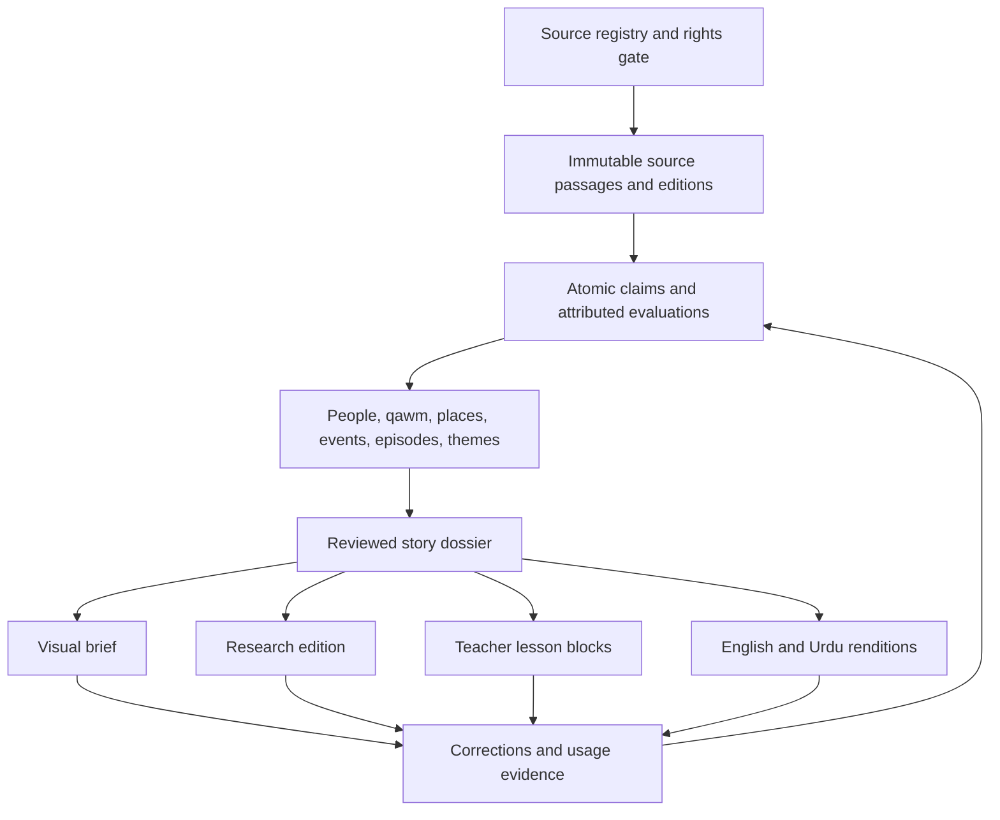

# Quranic Narrative and Evidence Atlas

## Product Strategy and Research Blueprint

**Document status:** revised research and product blueprint; founding decisions applied  
**Initial languages:** Arabic source text, English, and Urdu  
**Working posture:** academic with devotional respect; quotes sources, issues no rulings  
**Recommended platform:** responsive, indexable, statically generated web product  
**Companion documents:** [Product roadmap](./ROADMAP.md) ? [Visual design direction](./DESIGN.md) ? [Open resources and reuse catalog](./OPEN_RESOURCES_CATALOG.md) ? [Resource intake system](./RESOURCE_INTAKE_SYSTEM.md)

---

## 0. Two rules that override everything below

This document was written for a funded organization with a scholarly review board. **Neither exists.** Ten founding decisions ([?25](#25-founder-decisions--settled-and-open)) reduced the project to one person, an AI assistant, no money, and no reviewers, permanently and by choice.

The affected sections ? [?11](#11-sources-scope-and-classification) scope, [?15](#15-visual-system-sacred-depiction-and-accessibility) depiction, [?17](#17-editorial-scholarly-and-correction-governance) governance, [?23](#23-business-and-institutional-model) business model, [?25](#25-founder-decisions--settled-and-open) decisions ? have been rewritten. Elsewhere, any passage assuming staff, budget, or a reviewer describes a capability the project does not have. Read those as *what a resourced version would do*, not as commitments.

Two rules survive at higher priority than anything else in this document:

**1. Nothing is invented.** Not a report, chain, grade, verdict, page number, date, identification, or scholarly position. The product displays and discusses **existing, locatable** material only. Every published statement resolves to a work, edition, and page that a stranger holding that book can turn to. Anything that cannot be located does not exist for this product's purposes and does not publish. This binds the AI assistant absolutely ? its output is a *candidate* until the citation is opened and confirmed.

**2. Nothing is vouched for.** The project makes no claim of scholarly review, endorsement, or authority. Its offer is not *trust us* but *here is every source, at claim level, with the page ? check it.* That claim is weaker in authority, stronger in verifiability, and is the only one a single person can make honestly.

Rule 1 is what makes rule 2 worth anything. An unvouched-for resource that cites accurately is useful. An unvouched-for resource that invents is worse than nothing, because it poisons the true material sitting beside it.

---

## 1. Executive recommendation

There is a valuable and defensible product here, but it should not begin as another general Quran app or another illustrated ?stories of the prophets? collection.

Build a **Quranic Narrative and Evidence Atlas**: a bilingual research and teaching system that reconstructs stories scattered across the Quran, connects them to people, peoples, places, events, hadith, tafsir, later reports, history, archaeology, geography, and responsible scientific comparison, and shows the evidence status of every important detail.

The simple promise is:

> Understand the story quickly. Investigate every detail deeply. Always know what comes from where.

The more exact promise is:

> See what the Quran explicitly states, what sound reports add, how named tafsirs interpret it, which weak or disputed narrations exist, what later tradition relates, what historical or scientific evidence can and cannot establish, and what remains unknown.

### The core product decision

Build **one reviewed evidence corpus with multiple viewports**, not separate products for children, teachers, general readers, and researchers.

- **Learn** presents authored visual journeys adapted to age and task.
- **Teach** lets educators assemble reviewed material into lessons.
- **Research** exposes full prose, source comparison, alternative positions, notes, and export.

Every rendition resolves to the same stable claims, ayat, hadith records, interpretations, people, places, and events. Language and complexity may change; evidence status may not.

### The durable asset

The long-term moat is not the front-end interface. It is the reviewed, bilingual, versioned knowledge system:

`Ayah or passage ? claim ? source and evidence ? episode ? story ? person / qawm / place / event ? interpretation ? learner rendition ? English and Urdu edition`

### The initial wedge

Lead with **Peoples, Places, and Events of the Quran**, while supporting the most important prophetic narratives.

This wedge is more distinctive than a generic prophets catalog and naturally demonstrates:

- fragmented stories across surahs;
- qawm and civilization profiles;
- people and relationships;
- geography and competing identifications;
- narrative order versus proposed chronology;
- hadith and tafsir additions;
- archaeological and historical evidence;
- uncertainty and unknowns.

### The first three flagship dossiers

1. **Yusuf** ? tests a largely continuous Quranic narrative, character relationships, family trauma, and age adaptation.
2. **Musa and Pharaoh** ? tests a narrative distributed across many surahs, parallel passages, chronology, difficult content, and many linked people/events.
3. **Salih, Thamud, and al-Hijr** ? tests qawm, place, archaeology, hadith, competing identifications, and the boundary between tradition and material evidence.

### Platform decision

Start with a responsive website that behaves like an app because the product is:

- long-form and citation-heavy;
- discoverable through search;
- shareable at the exact ayah, claim, event, or source passage;
- useful on desktop for teaching and research;
- cheaper to test than separate native applications;
- capable of later offline PWA support.

Build native apps only when real behavior justifies offline study, audio, notifications, or device-specific teaching workflows.

### What not to promise

Do not market ?everything ever narrated? or ?the whole Quran fully mapped? until the declared source scope and coverage ledger support those claims.

Use the more credible promise:

> We preserve every traceable narration within a declared source scope, identify its source and evaluation, and show exactly what has and has not been reviewed.

---

## 2. Strategic market finding

The category is crowded, but the desired combination is not complete in any inspected product.

### Live interface audit

The following pages were inspected live. Competitor products change, so re-walk before relying on any row. A gap is reported only for the experience actually seen; gated or unseen functionality is not treated as absent.

| Product | Strong current pattern | Material gap observed |
|---|---|---|
| [Quran.com reader](https://quran.com/12) | Excellent calm verse-by-verse reading, translations, audio, notes, tafsir, lessons, and Urdu support | Tafsir remains long book-level prose; consequential statements inside it are not separated into Quranic fact, hadith, later report, interpretation, or disputed detail |
| [Quran.com Explore](https://quran.com/en/explore) and [Prophet Salih](https://quran.com/explore/prophet-salih) | Clean and approachable editorial cards and Quran passage display | Explore lacks story/person/qawm/place/evidence/age filters; the inspected Salih page was essentially a title and two verse groups rather than a narrative dossier |
| [Sadaa](https://sadaa.me/en/) | Valuable choice between guided themes and a visual explorer; a strong narrative taxonomy and many languages including Urdu | Onboarding obstructs first use; narrative selection resolves mainly into one verse group or card at a time; the graph?s relationships and evidence are not legible enough |
| [Quran Companion](https://quran-companion.co/) | Attractive, coherent story discovery, prophet profiles, parallel-story concept, and filtered timeline | Long repetitive timeline; proposed ancient dates appear without visible source, method, range, or alternatives; several research layouts clip on mobile |
| [Quranic Arabic Corpus](https://corpus.quran.com/ontology.jsp) | Strong structured precedent: named entities, occurrences, pronoun resolution, about 300 concepts and 350 relations | The legacy graph is taxonomic rather than narrative/evidential, fixed-width, and not designed for modern teaching or mobile use |
| [Qissah](https://qissahapp.com/quran-stories) | Accessible prose, audio-first storytelling, quick framing, categories, and public editorial standards | Story pages remain text-heavy; non-Quranic names, dates, and proposed chronologies are not consistently traceable at the point of claim |
| [Tawarikh](https://www.tawarikh.app/) | The closest structural precedent: chronological spine, event dossiers, story beats, search, source categories, and maps | A whole event can receive one confidence badge even when its title/detail mixes explicit Quranic text with interpretation; sources sit below rather than beside each assertion |
| [AlTafsir](https://www.altafsir.com/Index.asp) | Exceptional breadth of tafsir and school-level browsing | Form-heavy source retrieval, little narrative reconstruction, and no claim-level comparison |
| [IslamOne](https://islamone.app/) | Broad English/Urdu Quran, tafsir, hadith, and seerah access | The collections remain separate libraries rather than one connected narrative and evidence system |
| [Revealed by Bayyinah](https://revealed.bayyinahtv.com/) | Strong ?quiet mushaf first, depth on demand? concept | Full current teaching/research workflows are gated; it is an interaction inspiration, not evidence of a complete research system |

### What competitors center

- Quran.com centers the **ayah**.
- Sadaa centers the **theme or verse group**.
- Quran Companion centers the **visual topic or event**.
- Qissah centers the **prose story**.
- Tawarikh centers the **chronological event**.
- Quranic Corpus centers the **linguistic concept**.
- AlTafsir and IslamOne center the **source collection**.

The open position is to center the **auditable claim** and connect it to every one of those objects.

### The defensible gap

The strongest value is the combination of:

1. **Claim-level provenance**, not only a bibliography at the bottom.
2. **Narrative reconstruction** across non-contiguous ayat without replacing canonical surah order.
3. **A complete hadith dossier** with wording variants, numbering, isnad, and attributed?not invented?grades.
4. **Visible uncertainty and disagreement**, including alternative chronologies and locations.
5. **Responsible history, archaeology, geography, and science comparison**.
6. **A graphical short edition and a research-grade long edition generated from the same reviewed corpus**.
7. **Age-adaptive teaching without creating different truths for different ages**.
8. **English?Urdu editorial parity**, including search, typography, review, and teaching design.
9. **Research workflow**, including stable citations, saved evidence, exports, and version history.
10. **Coverage honesty**, so a user knows whether a page is fully reviewed, partial, or only Quran-linked.

### Positioning statement

For people who want to understand Quranic narratives beyond a simplified retelling, the Atlas is a visual research and teaching platform that connects every important detail to its source, evaluation, interpretation, and evidence. Unlike readers, article libraries, and story apps, it preserves disagreement and uncertainty while making dense scholarship understandable.

---

## 3. Product principles

### 3.1 The ayah remains the canonical anchor

Stories are curated views of Quranic material, never replacements for the Quran. Every narrative beat links to the exact ayat and lets the reader return to canonical surah order.

### 3.2 Consolidate research, not voices

The detail a reader most wants is often where certainty is weakest. Consolidate sources and arguments without merging them into one omniscient retelling.

### 3.3 One evidence corpus, multiple reviewed renditions

The visual edition, research edition, classroom lesson, English edition, and Urdu edition must derive from the same approved claims. No rendition may quietly strengthen, remove, or invent certainty.

### 3.4 Source type and claim status are separate

?A respected tafsir reports this,? ?a hadith critic grades this chain weak,? and ?an excavation established this date range? are different statements. Do not compress them into one numerical truth score.

### 3.5 Make ?unknown? a successful result

Unknown identity, disputed place, uncertain chronology, absent evidence, and ?not empirically testable? are valid conclusions. Honest incompleteness is a feature.

### 3.6 Preserve weak reports without promoting them

Research mode may preserve traceable weak, very weak, or fabricated reports when they are historically relevant. They must be visibly classified and cannot become the narrative backbone of a quick, child, or classroom version.

### 3.7 Visuals are arguments

A pin, line, date, family connection, face, reconstruction, and image all imply something. Every meaningful visual datum needs provenance and an uncertainty grammar.

### 3.8 English and Urdu are sibling editions

Both derive from the Arabic dossier. Urdu is not a machine translation of English and is not a decorative RTL skin over an English-first information architecture.

### 3.9 AI is an editorial assistant, not an authority

AI may help discover duplicate records, propose links, transcribe within a checked workflow, and prepare internal drafts. It may not grade hadith, translate Quran, invent citations, resolve scholarly disputes, or publish autonomously.

### 3.10 Coverage must be visible

The system should never imply that an attractive page is complete. Every object carries an explicit coverage and review state.

---

## 4. Users, intents, and age-adaptive modes

### Three primary intents

| Intent | Core job |
|---|---|
| **Learn** | ?Help me understand this story, its sequence, people, places, sources, and lessons at the right depth for me.? |
| **Teach** | ?Help me build a responsible lesson from reviewed material without opening ten books and sites.? |
| **Research** | ?Help me investigate a question, compare sources and positions, preserve citations, and see exactly what is established or disputed.? |

### Core user groups

- serious non-specialist English and Urdu readers;
- Islamic-school teachers, parents, and study-circle leaders;
- older students learning source literacy;
- khutbah and course researchers;
- converts and younger adults who need context before deep tafsir;
- scholars, hadith specialists, historians, scientists, language editors, and reviewers;
- academic researchers who need stable, exportable, machine-readable evidence.

### Age-adaptive modes

Age bands guide design; they do not diagnose ability. Families and teachers should be able to select a mode without disclosing a birth date or creating an account.

| Audience | Mode | Experience | Source transparency |
|---|---|---|---|
| 0?5 | **Listen & Wonder** | Adult-led, 3?5 minute scenes, one idea per scene, simple vocabulary, optional narration, large controls | Persistent simple lanes: ?In the Quran,? ?Scholars explain,? and ?We do not know? |
| 6?9 | **Story Explorer** | Five to seven event cards, a small cast, vocabulary, optional audio, one reflection activity | Quran and later material never visually merge; hadith detail stays expandable |
| 10?12 | **Evidence Explorer** | Seven to ten beats, simple timeline/map, parallel ayah links, first interpretation comparisons | Exact source types and simple explanations of hadith grades |
| 13?15 | **Critical Study** | Evidence tables, disputed views, history/science comparison, source-literacy tasks | Show who holds or grades each position and why certainty differs |
| 16?17 | **Advanced Study** | Near-full dossier, Arabic and translations, chronology/geography alternatives, notes and exports | Full citations, editions, graders, reviewers, and evidence limits |
| Adult/general | **Quick / Study / Full Evidence** | User-selected depth without assuming expertise from age | Every view can open the full source trail |
| Scholar/researcher | **Research Workbench** | Dense search, alignment, filters, annotations, data export, and revision history | Complete provenance and machine-readable objects where rights permit |

### Episode suitability, not blanket age labels

?For every age? does not mean every episode appears in every age band.

Each episode needs:

- minimum recommended mode;
- adult-led / teacher-led / independent suitability;
- content notes;
- violence, death, destruction, imprisonment, abuse, sexual themes, family trauma, polemics, and distress flags;
- approved language for each age rendition;
- image and audio restrictions;
- reviewer decision and review date.

### Recommended launch sequence

The architecture should support all ages, but editorial quality should be phased:

1. adult Research;
2. educator Teach;
3. ages 10?12 Evidence Explorer;
4. ages 6?9 Story Explorer and teen modes;
5. the specialized adult-led 0?5 format.

This sequence builds the evidence foundation before the most sensitive simplification work.

---

## 5. Experience architecture

### Global navigation

- **Explore**
- **Stories**
- **People**
- **Peoples & Nations**
- **Events**
- **Places**
- **Themes**
- **Quran**
- **Teach**
- **Research**
- **Sources & Method**
- **Search**

### Four principal surfaces

#### Story Canvas

The graphical short version for learning and teaching:

- paced story beats;
- synchronized Quran anchors;
- visual cast and relationship strip;
- map or sequence where useful;
- clear evidence lanes;
- bounded comparisons;
- vocabulary, lessons, and questions;
- immediate route to Full Evidence.

#### Evidence Desk

The long research version:

- primary text and parallel passages;
- full prose and methodology;
- claim-by-claim evidence;
- hadith, tafsir, and later-report comparison;
- alternative chronologies and locations;
- history, archaeology, and science;
- bibliography, review, versions, notes, and export.

#### Teacher Studio

The educator workspace:

- choose learner band, language, duration, and objective;
- arrange approved blocks into a lesson;
- preview sensitive material;
- add teacher-only notes;
- use projector mode;
- export bilingual handouts with citations.

#### Quran Reader

The canonical reading experience:

- surah and ayah order;
- Arabic, English, and Urdu;
- audio and familiar reader controls where licensed;
- unobtrusive links to stories, episodes, people, places, themes, and claims;
- ?quiet first, depth on demand.?

### Key cross-surface behavior

Selecting one story beat should synchronize:

- the relevant ayat;
- participants;
- place hypotheses;
- narrative position;
- proposed historical dates, if any;
- relevant hadith and tafsir;
- evidence and status;
- teacher and age renditions.

A source drawer should open without losing reading position.

---

## 6. One canonical corpus, many renditions

Use a **total corpus, selective viewport** model: preserve the full declared evidence base once, then reveal the right amount for the current user and task.



### The plain-language layer ? what it is, and the line it must not cross

**Settled: public-domain translations are the source; a plain-language English restatement sits on top of them, generated with AI assistance, and is never presented as a translation.**

The reasoning is sound. The English translations that are free to use are the old ones, and old English is a real barrier ? a reader who bounces off "verily" and "thou" has been failed by the licence situation, not by the Quran. A tap on an ayah opening a clear modern restatement fixes that at low cost.

**But this is the single most dangerous feature in the product, and it needs the tightest rules in this document.** Everywhere else, the assistant arranges material that already exists. Here it produces prose about the meaning of revelation. Get the labelling wrong and the project ships an unattributed, unreviewed translation ? which is precisely what [?0](#0-two-rules-that-override-everything-below) exists to prevent.

The line: **the restatement is a reading aid derived from named translations. It is not a translation, not a tafsir, and carries no authority of its own.**

Rules, all binding:

1. **Never shown alone.** The public-domain translation it derives from is always on screen or one tap away, named. The restatement is visibly secondary to it ? smaller, or in a panel, never in the ayah's primary slot.
2. **Named derivation.** Every restatement records which translation or translations it was built from. `Plain English, from Sale / Palmer / [PD translation], not a translation.` No sourceless restatements exist.
3. **A visible, permanent label in the interface**, in the reader's language, not buried in an About page. It says what the thing is and what it is not.
4. **It may simplify. It may not add.** Anything not in the source translation ? a name, a reason, a place, a connective "because" ? is an addition and does not belong. Simplifying is dropping archaism and untangling clauses. Explaining is a different act and belongs in the tafsir layer, cited.
5. **Where the underlying translations disagree, it does not smooth.** It shows the divergence or it does not render for that ayah. Averaging two translations into one confident sentence manufactures a reading neither translator made.
6. **Every restatement is read against its source before it publishes**, and it enters the [verification ledger](#17-editorial-scholarly-and-correction-governance) like any other claim. This is composing, not attesting ? but composed prose about revelation still gets checked line by line.
7. **The Urdu edition does not get a machine-derived equivalent by default.** Urdu is composed natively by decision 4, and a generated Urdu restatement of a generated English restatement is two removes from any source. If a plain-Urdu layer is wanted, it is built from Urdu public-domain translations directly, under these same rules.

**If any of these cannot be held, the layer does not ship and the product shows the archaic translation as-is.** An old translation, correctly attributed, is a real thing. A modern-sounding paraphrase with no author is not.

### Main content objects

| Object | Purpose |
|---|---|
| Ayah or passage | Immutable Quran anchor and translation alignment |
| Work and edition | Bibliographic identity, rights, version, and citation |
| Source passage | Exact quoted or paraphrased evidence unit |
| Claim | Smallest substantive editorial statement |
| Evaluation | An attributed grade, interpretation, historical assessment, or review |
| Story | Complete study journey such as Yusuf |
| Episode | Bounded narrative unit within one or more stories |
| Event | What happened, participants, sequence, and evidence basis |
| Person | Names, aliases, actions, speech, relationships, mentions, and interpretations |
| People / qawm | Messenger, conduct, outcome, places, occurrences, and later identifications |
| Place | Named place, region, aliases, geometries, and competing hypotheses |
| Time assertion | Narrative order, date/range proposal, proposer, evidence, and uncertainty |
| Theme / concept | Multilingual topic, hierarchy, related terms, and occurrences |
| Hadith report | Matn, isnad, variants, numbering, editions, and attributed evaluations |
| Tafsir position | Named interpretation tied to an author, work, period, and passage |
| Empirical comparison | Textual interpretation compared with defined historical/scientific evidence |
| Rendition | Reviewed short, age-band, teaching, English, or Urdu expression of a claim |
| Review | Reviewer, expertise, decision, date, and revision trigger |
| Rights record | Permission, restrictions, attribution, and expiry/recheck |

### Essential relationships

- an ayah participates in one or more episodes;
- an episode can appear in several story views;
- a person or qawm participates in events and relates to other entities;
- a claim cites one or more exact source passages;
- a source can support, qualify, contextualize, or challenge a claim;
- a location and date can have several competing assertions;
- a hadith report can have several wording or chain variants and several attributed grades;
- a tafsir author can hold different positions on different claims;
- an age or language rendition derives from a stable approved claim;
- every visual mark resolves to the claim that justifies it.

### Minimum canonical claim record

Each substantive claim needs:

- stable claim ID and human-readable slug;
- claim text in its editorial/source language;
- exact Quran anchors, if any;
- linked source passages and relationship type;
- source class;
- interpretation or evidence status;
- relevant people, qawm, places, events, and themes;
- full scholarly explanation;
- short visual caption;
- English and Urdu renditions;
- age-band renditions where approved;
- sensitivity and depiction classification;
- reviewer, decision, review date, and revision history;
- rights and quotation status;
- public correction history.

### Do not simplify away uncertainty

A child rendition can say:

> People have suggested more than one place, and we do not know for certain.

It may not turn a disputed location into a fact merely because the full methodological explanation is omitted.

---

## 7. Coverage and completeness

The product can aspire to comprehensive coverage only through a declared, measurable scope.

### Coverage dimensions

For every story and entity, track:

- all linked Quran passages mapped;
- Arabic text verified;
- English and Urdu translation alignment complete;
- core tafsir sample reviewed;
- hadith search complete for declared collections;
- hadith variants and grades reviewed;
- later reports and Isra?iliyyat reviewed;
- people and qawm links complete;
- places and aliases reviewed;
- narrative sequence reviewed;
- chronology and geography claims reviewed;
- history/archaeology review complete where relevant;
- science review complete where relevant;
- research edition complete;
- short edition complete;
- educator blocks complete;
- approved age renditions;
- accessibility and RTL QA complete;
- rights cleared;
- next review date.

### Public coverage labels

- **Fully reviewed**
- **Research edition complete; teaching adaptations partial**
- **Partially mapped**
- **Quran links complete; secondary sources in review**
- **Base text only**
- **Revision in progress**

Search results and navigation should display these labels. An unfinished page should remain useful without pretending to be complete.

---

## 8. Signature experience: the story dossier

### Short graphical edition

The visual brief should contain:

1. one central question or learning objective;
2. a thirty-second overview;
3. a visual cast strip;
4. five to nine story beats;
5. Quran anchors on every beat;
6. synchronized map or sequence where useful;
7. three visible evidence lanes:
   - Quran explicitly states;
   - hadith or named tafsir adds;
   - disputed, inferred, or unknown;
8. one bounded history/science/geography comparison where responsible;
9. key ideas and one reflection or source-literacy activity;
10. ?Open Full Evidence.?

The visual edition should be authored and reviewed. It should never be an automatically shortened version of the research prose.

### Long research edition

The Evidence Desk should include:

1. abstract and research questions;
2. scope and methodology;
3. Quran passage matrix across surahs;
4. reconstructed narrative sequence;
5. narrative order versus proposed chronology;
6. hadith dossier;
7. tafsir synoptic comparison;
8. later tradition and Isra?iliyyat;
9. people, qawm, and relationship evidence;
10. historical and archaeological evidence;
11. geographic hypotheses;
12. science or natural-world comparison where responsible;
13. competing interpretations;
14. claim-by-claim evidence inspector;
15. lessons and reception, clearly separated from historical claims;
16. bibliography and cited editions;
17. reviewers, correction history, and change diff;
18. citation and permitted data export.

### Personality and character treatment

For a notable person, distinguish:

- actions and speech explicitly described by the Quran;
- qualities explicitly praised or condemned;
- traits inferred by a named scholar;
- hadith or later biographical reports;
- editorial interpretation.

Avoid:

- invented inner thoughts;
- unsupported physical descriptions;
- modern clinical labels;
- personality tests;
- assigning motives that the sources do not state.

Use wording such as ?the passage portrays,? ?Commentator X infers,? or ?a later report relates.?

### Example: Thamud and al-Hijr

A normal story page can present a smooth retelling and photographs of Hegra as if every identification were settled. The Atlas should separate:

- **Quranic layer:** all passages about Salih, Thamud, dwellings, the she-camel, rejection, and outcome.
- **Hadith layer:** relevant reports with exact collection, variant, numbering, edition, and attributed evaluation.
- **Tafsir layer:** how named commentators connect Thamud, al-Hijr, visible dwellings, and later travel instructions.
- **Geographic layer:** the traditional association, alternative scope, historical place names, and what is actually named by the Quran.
- **Archaeological layer:** [UNESCO?s description of Hegra](https://whc.unesco.org/en/list/1293), including the primarily Nabataean monumental remains and their dating.
- **Editorial conclusion:** the traditional identification and surviving archaeology are related research questions; the visible monuments alone do not prove every detail of a proposed Quranic reconstruction.
- **Unknowns:** exact chronology, which surviving structures belong to which period/population, and what material evidence can establish about the narrated event.

The map should show a sourced traditional site and any credible alternative hypothesis?not one unqualified ?true location? pin.

---

## 9. Trust and source model

### Source classes

| Source class | Reader-facing language |
|---|---|
| Quran | ?The Quran explicitly states?? |
| Named translation | ?Translator X renders the phrase as?? |
| Hadith | ?This is reported in X; Scholar Y evaluates it as?? |
| Athar | ?This is attributed to Companion/Successor X in?? |
| Tafsir | ?Commentator X records/interprets?? |
| Sira or historical chronicle | ?Historian X relates?? |
| Later tradition / Isra?iliyyat | ?A later narrative relates?? |
| Manuscript / inscription / excavation | ?This material source establishes/suggests?? |
| Modern historical scholarship | ?Researcher X argues?? |
| Science | ?Current evidence is compatible with / does not establish?? |
| Editorial synthesis | ?Our editors reconstruct/infer?? |

### Four independent axes

Do not use one badge for everything.

#### A. Source class

Where does the material come from?

#### B. Claim status

- explicit in the cited text;
- well-attested report;
- documented majority interpretation;
- documented minority interpretation;
- disputed;
- editorial synthesis;
- historical hypothesis;
- empirically established within defined limits;
- evidence developing;
- unknown;
- not empirically testable.

#### C. Attributed evaluation

For example:

- a named hadith critic?s exact grade;
- a historian?s dating;
- an archaeologist?s identification;
- a scientist?s evidence assessment;
- a jurist or exegete?s interpretation.

#### D. Editorial review state

- imported;
- source verified;
- specialist review required;
- religious review approved;
- domain review approved;
- language review approved;
- rights approved;
- published;
- correction pending;
- retired with reason.

### Avoid fake precision

Do not show:

- ?80% of scholars agree? unless a defensible methodology exists;
- a numerical authenticity score;
- a confidence percentage for a disputed place;
- a proof meter for science;
- a single event-level badge when the event contains mixed claims.

Use named positions, evidence, and plain-language status instead.

---

## 10. Hadith system

Hadith is not an add-on citation field. It requires its own scholarly and data model.

### Minimum record

Each report should store:

- stable internal report ID;
- collection/work and canonical work authority;
- book, chapter, volume, page, publisher, edition, and date;
- primary number and every common alternate numbering system;
- Arabic matn;
- licensed English and Urdu translations;
- isnad segmented into ordered narrator references;
- narrator identities, aliases, uncertainty, and biographical authority links;
- wording and chain variants;
- parallel transmissions and takhrij links;
- attribution type;
- every displayed grade as an assertion:
  - named grader;
  - exact grade wording;
  - cited work;
  - edition and page;
  - date or scholarly period;
- disagreements between graders;
- what the report adds to a claim or episode;
- rights for Arabic, translation, notes, and export;
- reviewer and revision history.

### Keep grading dimensions distinct

Do not merge:

- mode or breadth of transmission;
- chain continuity;
- narrator criticism;
- matn criticism;
- a named scholar?s overall grade;
- authenticity of one route versus a report family;
- interpretation of the report;
- relevance to the current claim;
- suitability for a teaching mode.

The interface should say **who graded what, where, and how that grade relates to the displayed variant**.

### Strong, weak, very weak, and fabricated material

#### Sound or acceptable reports

- May contribute to the core narrative when relevant and reviewed.
- Still require exact attribution, variant, translation, and interpretation.
- ?Sahih? is not permission to overstate what the matn means.

#### Weak reports

- Preserve in Research when traceable and relevant to the history of interpretation.
- Display a persistent warning and named evaluation.
- Explain whether scholars use it in virtues, history, or not at all within the declared methodology.
- Do not use it as the emotional centerpiece or missing plot bridge in a child/quick retelling.

#### Very weak or fabricated reports

- Include only when there is a clear research reason, such as correcting a popular story or documenting reception.
- Label prominently and explain the attributed judgement.
- Exclude by default from Learn and classroom-facing prose.
- Avoid vivid circulation that could make the false account more memorable than the correction.

#### Disagreement

Show the attributed evaluations side by side. Do not decide by averaging labels.

Example:

```text
Attributed evaluations
? Critic A: hasan ? [work, edition, locator]
? Critic B: da'if ? [work, edition, locator]

Editorial use
The report is preserved in the research dossier. It is not used to establish
the core story beat because the cited evaluations differ and the Quranic
passage does not require this added detail.
```

### Isnad visualization

The isnad graph should:

- show narrators in chain order;
- distinguish certain, uncertain, and merged identities;
- group parallel routes and wording families;
- identify missing/disputed links;
- open a narrator authority record from every node;
- attach evaluation and source to every critical assertion;
- provide a table alternative;
- state that visual completeness does not itself prove authenticity.

### Hadith acquisition strategy

No open dataset identified in the current review is independently sufficient for production-grade Arabic, translations, numbering, variants, and attributed grading.

Use open datasets for:

- discovery;
- alignment;
- prototype isnad graphs;
- duplicate and numbering research.

Then verify against named editions and obtain written agreements where required. Seek partnerships with sources such as [Sunnah.com](https://sunnah.com/developers) and [HadeethEnc](https://hadeethenc.com/en/home/developers) rather than scraping them.

---

## 11. Tafsir, athar, sira, and later narrative

### Tafsir comparison

Each tafsir source card needs:

- author and dates;
- scholarly tradition and region;
- exegetical method;
- original language;
- work and edition;
- translator and translation edition;
- complete, abridged, translated, or editorially summarized status;
- quotation and reproduction rights.

The synoptic view should compare a question, not merely display several long texts:

| Research question | Commentator | Position | Evidence used | Method/period | Status |
|---|---|---|---|---|---|
| Who is being identified? | Named author | Exact view | Ayah/report/language | Context | Majority/minority/disputed |

Never manufacture consensus from a small set of selected tafsirs.

### Declared theological scope

**Settled: Sunni and Shia side by side, both primary.** Neither is framed as the majority view with the other appended. Academic and historical-critical scholarship appears as a labelled third kind of source, not as an arbiter between the two.

Published scope statement:

> A multi-tradition source atlas. Sunni and Shia positions are presented in parallel from their own primary works, each cited to edition and page. The project does not adjudicate between them, does not issue rulings, and has no scholarly review board from either tradition.

### The condition this scope depends on

This document previously warned that a multi-tradition platform "requires meaningful scholarly governance from every represented tradition" and "must not be simulated by adding a few books." There is no governance from either tradition ([?17](#17-editorial-scholarly-and-correction-governance)), so that warning has to be answered rather than ignored.

It is answered by narrowing what the product claims to do. The warning targets **synthesis** ? a product speaking *about* a tradition in its own voice, summarising "the Shia view" or "the Sunni position," which genuinely does require someone from that tradition to be accountable for the characterisation.

This product does not do that. It **quotes and locates**. `Tafsir al-Mizan, vol. X, p. Y says this. Tafsir Ibn Kathir, ed. Z, p. W says that.` Both shown, both sourced, neither summarised into a house position. That is a bibliographic act, not a theological one, and it does not require credentials from either tradition ? only accuracy, which is checkable by anyone holding the book.

**The operating rules that keep it on the right side of the line:**

1. **Never write "Sunnis believe" or "the Shia position is."** Write which named scholar, in which named work, on which page, said what.
2. **Never resolve a difference,** including by ordering, emphasis, word count, or which view appears first by default. Parallel means parallel.
3. **Never characterise one tradition using the other's sources** ? a Sunni polemical description of a Shia position is a Sunni source about a Shia position, and is labelled exactly that.
4. **Internal difference within each tradition is shown too.** Neither is a monolith, and flattening either one is the same error as flattening the difference between them.
5. **Where no parallel source has been located, say so.** An empty column is honest; a filled-in-by-inference column violates [roadmap ?0](./ROADMAP.md).

If the product ever finds itself needing to state what a tradition holds, rather than what a named book says, it has exceeded its scope and the passage does not publish.

### Is Shia parity actually difficult? ? checked

The question put to research was whether Shia coverage is hard enough to drop. **Answer: the English and Arabic side is not hard. The Urdu side is.**

Not hard ? Shia primary material is reachable:

- **Thaqalayn** is a comprehensive Shia digital library carrying al-Kafi, Man La Yahduruh al-Faqih, Nahj al-Balagha, Kamal al-Din, Kitab al-Ghayba and around twenty other collections, in Arabic with English translation. The site publishes no licence; the data repository behind it declares **CC0-1.0** while naming no source, translator, or rights holder for what are largely modern English translations. That is **rights-declared but unverified**, which is weaker than it looks ? a public-domain dedication is only effective if applied by the owner. **Discovery tier only** ([catalogue ?4](./OPEN_RESOURCES_CATALOG.md)).
- **al-Islam.org** (Ahlul Bayt Digital Islamic Library Project) holds a large translated corpus, explicitly **non-commercial, hosted by permission of copyright holders it does not itself own**. Usable in the same conditional way Tanzil is; not relicensable onward.
- **The Rezwan corpus** (Najm Institute) is a machine-processed hadith corpus spanning Shia and Sunni collections, with JSON and CSV samples and full access behind a request form.
- **OpenITI** and the **KITAB** project already treat Shia hadith collections as first-class corpora for text-reuse analysis.
- **Tafsir al-Mizan** (Tabataba'i) exists in English translation and is the natural parallel to Ibn Kathir on the tafsir axis. It is also modern and in copyright ? cite and quote at claim level, do not host.
- **Tabarsi's *Majma' al-Bayan li-'Ulum al-Qur'an*** is the parallel that costs nothing: classical, out of copyright, and available as **page images of a printed nine-part edition** ([catalogue ?3b](./OPEN_RESOURCES_CATALOG.md)). This matters more than it first appears. The parity requirement is not really "have a Shia source" ? it is "be able to open a Shia source to a page", which is what [?0](#0-two-rules-that-override-everything-below) demands and what an aggregator's JSON cannot supply. *Majma' al-Bayan* supplies it. The al-Mizan copyright problem made the parity layer look expensive; it is not.

Hard ? the Urdu ceiling, detailed in [?16](#16-englishurdu-parity): the available Shia Urdu translations are modern and copyrighted, with no public-domain equivalent to the Sunni ones.

**Decision: Shia stays. The difficulty is real but it is a licence difficulty in one language, not a source-availability problem.** Dropping a whole tradition to solve an Urdu rights gap would be trading the product's main differentiator for the cheapest possible fix.

**The rule that makes it survivable: parity is per claim, not per product.** Where a Shia source has been located and its rights are clear, it publishes in both languages. Where the Urdu rights are not clear, the Urdu edition shows the Arabic with an English or Urdu-composed *summary attributed to the located source*, and states plainly that the Urdu rendering of that work could not be licensed. An empty labelled column is honest ([rule 5 above](#the-condition-this-scope-depends-on)). A quietly Sunni-only Urdu edition is not.

**Revisit trigger, not a schedule:** if a located Shia Urdu source with clear rights is found, or if Thaqalayn can name the translations and rights holders behind its CC0 declaration, this section is rewritten. Until then the constraint is disclosed rather than hidden.

### Athar and sira

Treat Companion/Successor reports, sira, and historical chronicles as their own source classes. Do not relabel them as hadith or merge them into Quranic narration.

### Isra?iliyyat and later stories

Use explicit categories:

1. corroborated by the Quran or sound prophetic evidence;
2. contradicted by those sources;
3. uncorroborated, related as a tradition with judgement suspended;
4. judged weak, very weak, or fabricated by a named authority;
5. popular retelling with no traceable early source.

Research mode can document their reception. Quick and child modes should not use them to make the story feel more complete.

---

## 12. History, archaeology, geography, and chronology

### Evidence hierarchy by question, not by prestige

Use the source appropriate to the claim:

- inscriptions and manuscripts for attested names or wording;
- excavation reports for context and dating;
- museum records for object provenance;
- peer-reviewed synthesis for current interpretation;
- historical chronicles for what a writer in a particular period related;
- modern gazetteers for present names;
- Quran, hadith, and tafsir for their own religious/textual claims.

One source type cannot silently answer a different kind of question.

### Material evidence record

Store:

- object/site/report ID;
- description;
- discoverer/excavation;
- provenance and find context;
- dating method and range;
- publication and page;
- current repository;
- image/object rights;
- interpretation;
- counter-interpretations;
- connection proposed to a Quranic claim;
- reviewers and review date.

### Geography as hypotheses

For every proposed place:

- canonical place concept;
- names and aliases by language and period;
- geometry type: point, region, corridor, polygon, unknown;
- proposed geometry;
- associated period;
- proposer and source;
- supporting evidence;
- counter-evidence;
- status;
- alternative hypotheses;
- reviewer and revision date.

Use:

- a point only when the evidence supports one;
- an uncertainty halo for approximate locations;
- a region for broad identification;
- hatched polygons for reconstructed boundaries;
- separately toggleable layers for competing proposals;
- modern borders labeled as modern context.

### Three worked cases that set the house standard

These are the calibration set. Each fails differently, and a method that handles all three handles most of the corpus.

**Al-Hijr / Hegra (Thamud) ? strong material evidence, weak identification.** Hegra is a UNESCO World Heritage Site with 116 monumental rock-cut tombs, extensive Nabataean, Lihyanite, and Thamudic inscription, and active excavation. The evidence is abundant ? and mostly Nabataean, from a period considerably later than the qawm the Quran describes. The dossier must therefore hold two records that a reader will want to collapse into one: *the excavated site*, richly evidenced, and *the qawm of Salih*, textually attested and archaeologically thin. Confusing them is the single most common error in popular treatments of this story, which is exactly why the product should render the distinction visibly rather than argue it in a footnote.

**Iram and Ubar ? a famous identification that did not hold.** Iram of the Pillars (89:6?8) is commonly equated with Ubar, and the 1991 Shisr excavation in Oman was widely reported as its discovery. The scholarly position is that no direct evidence has been established. This is the reference case for the product's hardest interface requirement: rendering *a widely believed identification that the evidence does not support*, without either endorsing it or being dismissive of why people believe it. If the map shows a confident dot at Shisr, the whole geography layer is compromised.

**Ashab al-Kahf ? irreducibly plural.** Two long-standing candidate sites, Ephesus (a church built there under Theodosius II in 446 CE) and al-Rajib near Amman (a Byzantine burial cave), with substantial disagreement among scholars over both site and details. The Quran itself declines to settle the number of sleepers (18:22), which makes this the best available teaching case for disclosed uncertainty as a *religious* value rather than an editorial hedge. Both hypotheses ship as separately toggleable layers; neither is default-on.

**The rule the three cases produce:** the map renders identifications at the confidence of the *identification argument*, never at the confidence of the *underlying site's excavation*. A well-excavated site attached to a speculative identification is a speculative claim.

### Chronology

Store and display these separately:

1. Quranic/narrative order;
2. relative sequence inferred by editors or scholars;
3. proposed calendar date or range;
4. competing chronology;
5. method and source;
6. uncertainty.

Use date ranges and the [Extended Date/Time Format](https://www.loc.gov/standards/datetime/) where practical. Never turn an approximate or theological event into a precise historical dot merely to make a timeline look complete.

### Reader-facing map and timeline rule

Every pin, route, boundary, and date must answer:

> Why is this shown here?

The answer opens the evidence, status, alternatives, and reviewer.

---

## 13. Quran and science

Do not build a ?science proves the Quran? scoreboard. Compare a **specific interpretation** with a **specific item or body of evidence**.

### Required comparison structure

`Quranic wording ? interpretation evaluated ? empirical question ? evidence ? methods and limits ? outcome ? reviewers ? date`

Each comparison should contain:

1. exact ayah and relevant Arabic wording;
2. genuine linguistic range;
3. representative premodern interpretations;
4. the modern interpretation being evaluated;
5. a narrow empirical proposition;
6. evidence and current expert consensus where one exists;
7. methods, sample limits, alternative explanations, and counter-evidence;
8. what science cannot evaluate;
9. **the published secondary literature evaluating this specific claim**, cited ? including critics of the interpretation, who in this genre are usually easier to locate than defenders;
10. **a named scientific source for the empirical side** ? a review article, consensus statement, or textbook, cited to edition and page, never a summary written from memory;
11. last-checked date and update trigger.

Items 9 and 10 replace the reviewer sign-offs that this section previously required. With no reviewers ([?17](#17-editorial-scholarly-and-correction-governance)), the substitute is **not** the author's own judgement of the science ? it is locating people who have already published on the question and citing them. Where no such literature has been located, the comparison does not run, and the dossier says so.

**Consequence, and it is the correct one:** "No responsible comparison available" will be the most common outcome in this layer. It must render as a normal, unembarrassed result rather than a gap.

### Reader-facing outcomes

- **Non-empirical:** theological, moral, or metaphysical; science cannot test it.
- **Compatible:** current evidence does not conflict with this reading but does not uniquely establish it.
- **Inconclusive:** the evidence or textual interpretation is too broad.
- **Contested:** relevant experts or studies materially disagree.
- **Tension with this interpretation:** evidence challenges one reading, not ?the Quran? as a single scientific hypothesis.
- **No responsible comparison available:** categories do not align or evidence is inadequate.

### Prohibited patterns

- numerical miracle hunting;
- changing translation to fit a discovery;
- cherry-picking one paper;
- treating a metaphor as a laboratory proposition without argument;
- using current scientific uncertainty as proof;
- hiding historical interpretation;
- using ?scientists say? without a cited review or body of evidence;
- presenting an AI summary as scientific review.

The science layer should teach the reader how comparison works, not merely provide apologetic conclusions.

### The distinction the whole layer rests on

Two things are routinely conflated and must be separated in the interface, not merely in an editor's head:

- ***tafsir 'ilmi*** ? interpreting a Quranic passage in light of scientific knowledge. A legitimate, long-contested interpretive activity. It produces **an interpretation**, which can be evaluated, disagreed with, and revised.
- ***i'jaz 'ilmi*** ? the claim that a passage contains knowledge unavailable at the time of revelation and is therefore miraculous. This is **an argument**, and a much heavier one: it requires establishing what was and was not knowable in the 7th century, that the reading is the natural reading and not one retrofitted after the discovery, and that the science it depends on is settled.

The product renders the first as an interpretation among interpretations, and the second only where the argument is made explicitly and its premises are individually inspectable. A dossier may never slide from the first to the second by tone.

**The failure mode is documented.** Scholarly critique of the *i'jaz* genre finds that it blends readily with pseudoscience and conspiracist material, and that in stretching passages to meet current findings it burdens the text with interpretations it cannot bear. The Bucaillist strand is the standard cautionary case: it ties the authority of a permanent text to the state of a changing discipline, so that every scientific revision becomes an apologetic liability. A resource built to survive scrutiny cannot take on that debt.

Two structural consequences:

1. **The comparison is with an interpretation, never with the Quran directly.** The unit under evaluation is always "this reading of this wording," and it is named, dated, and attributed. When empirical evidence moves against it, what is revised is the reading ? which is the honest outcome and also the only one that leaves the text untouched.
2. **"No responsible comparison available" must be a common outcome, and must look normal.** If that verdict is rare or visually apologetic, the layer has become advocacy. Most passages are not empirical propositions, and the interface should make saying so unremarkable.

---

## 14. Teaching system

### Learning design principles

Use meaningful words and visuals together, but avoid simultaneous overload. Research on multimedia learning supports:

- segmenting;
- signaling;
- pre-teaching key terms;
- learner-controlled pacing;
- removing decorative information that competes with the lesson.

The product should use multiple means of representation?readable text, meaningful diagrams, optional audio, glossary help, and different ways to demonstrate understanding?without promoting unsupported ?visual learner versus auditory learner? labels.

Relevant foundations include [Mayer and Moreno on cognitive load](https://doi.org/10.1207/S15326985EP3801_6), [dual coding in education](https://doi.org/10.1007/BF01320076), and [CAST?s Universal Design for Learning Guidelines](https://udlguidelines.cast.org/).

### Teacher Studio

An educator should be able to:

- select learner band, language, lesson duration, and objectives;
- choose classroom, home, study circle, or presentation;
- drag approved ayat, story beats, maps, source cards, vocabulary, and questions into a lesson path;
- reveal information progressively in projector mode;
- see teacher-only scholarly disagreements and common misconceptions;
- preview sensitive content;
- use bilingual vocabulary and optional narration/transcripts;
- create printable materials;
- assess sequence, comprehension, comparison, and source literacy;
- preserve citations and reuse rights in exports.

### Assessment should measure

- Can the learner reconstruct the sequence?
- Can the learner distinguish Quran, hadith, tafsir, later tradition, and modern evidence?
- Can the learner identify a disputed or unknown detail?
- Can the learner compare two passages or interpretations fairly?
- Can the learner transfer the method to a new story?

Do not score faith, piety, or theological worth.

### Difficult material

For violence, destruction, abuse, imprisonment, family trauma, or other difficult histories:

- give educators a content preview;
- use restrained language and imagery;
- provide respectful discussion protocols;
- allow an image to be skipped without losing the account;
- never gamify punishment or tragedy;
- provide a calm exit and trusted-adult guidance for younger learners.

---

## 15. Visual system, sacred depiction, and accessibility

The complete visual specification is in [DESIGN.md](./DESIGN.md).

### Core visual components

- story-beat rail;
- passage matrix across surahs;
- cast and relationship neighborhood;
- source lanes;
- claim and source drawer;
- alternative chronology tracks;
- uncertainty-band timeline;
- multi-hypothesis map;
- isnad and narrator graph;
- tafsir comparison matrix;
- science/history comparison matrix;
- vocabulary and teaching cards;
- coverage and revision indicators.

### Depiction policy

**Settled: no human figures at all.** Not prophets, not angels, not companions, not anonymous crowds, not silhouettes, not glowing substitutes, not hands or feet in frame. No exceptions, no opt-in research context, no age-gated view.

**Settled: movement is shown as footprint traces.** A print is an impression left in ground ? an object, like an inscription or a wheel rut ? not a depiction of a body, so it sits inside the rule rather than at its edge. Trails render at the confidence of the route argument and stop where the sources stop. Full vocabulary and rules in [design ?10](./DESIGN.md).

This goes further than the minimum most positions require, and it is deliberate. A rule with zero exceptions needs no adjudicator ? which matters, because there is no review board (?17) to adjudicate. It is also the single largest cost reduction available: figurative illustration was the most expensive and highest-risk line in the production budget, and removing it removes both.

What remains, and it is enough:

- landscapes, routes, terrain, environmental change over time;
- architecture, excavation plans, site sections, reconstructions;
- objects, materials, inscriptions, coinage;
- maps at stated confidence;
- abstract diagrams ? chains of transmission, episode sequence, source relationships;
- calligraphy and typographic treatment.

Every reconstruction and generated image is labelled as illustration. Historical manuscript depictions containing human figures are **not reproduced**, in any context, including art-historical discussion ? they may be described and cited, not shown.

### Avoid visual false certainty

- A photo does not prove a proposed archaeological identification.
- A graph edge does not prove a relationship.
- A complete-looking isnad line does not establish authenticity.
- A precise pin does not establish a disputed location.
- A precise date does not establish an uncertain chronology.

### Accessibility

Target [WCAG 2.2 AA](https://www.w3.org/TR/WCAG22/).

- semantic HTML and real text;
- keyboard-accessible controls and visible focus;
- text/table alternatives for maps, timelines, and graphs;
- transcripts and captions;
- color plus icon plus written status;
- font, line-height, contrast, and content-width controls;
- reduced-motion support;
- correct language tags and bidirectional isolation;
- tested Arabic, English, Urdu Nastaliq, Urdu Naskh, Roman Urdu, numerals, citations, copying, and wrapping.

Every essential visual route needs a meaningful nonvisual route.

---

## 16. English?Urdu parity

### Editorial workflow

1. Build the Arabic source dossier.
2. Extract atomic claims.
3. Approve evidence and statuses.
4. Draft English and Urdu independently.
5. Perform native-language substantive editing.
6. Back-check quotations and religious claims against the Arabic.
7. Conduct scholar review in each language.
8. Conduct cross-language consistency review.
9. Complete citation, rights, accessibility, and rendering QA.

### Shared concept layer

Maintain controlled multilingual authority records for:

- names and alternate spellings;
- Arabic forms;
- English forms;
- Urdu forms;
- Roman Urdu variants;
- honorifics;
- qawm / qaum / ??? and other high-variance terms;
- theological and hadith terminology;
- historical place names and modern equivalents.

Search should recognize examples such as:

- Musa, Moses, Moosa, ????, ?????;
- Thamud, Thamood, Samood, ????;
- qawm, qaum, ???;
- common Urdu spelling and Roman Urdu variants.

### Typography and layout

- Treat Nastaliq as a first-class design case with appropriate line height and measure.
- Offer a tested Naskh alternative for dense research.
- Do not assume RTL is a mirror image of the English layout.

### The Urdu acquisition constraint ? plan around it, do not discover it late

Urdu parity is limited by a hard technical ceiling on *getting Urdu text in at all*. Nastaliq is materially harder to recognize than Naskh: on a printed Urdu newspaper benchmark, the best evaluated model reaches a word error rate of about 0.133, every model tested performs markedly worse on Nastaliq than on Naskh, and handwritten Urdu recognition sits around 55?70% accuracy. Set against the intake thresholds in [RESOURCE_INTAKE_SYSTEM.md](./RESOURCE_INTAKE_SYSTEM.md) ? 0.1% for translation alignment, 0.5% for hadith text ? **OCR output of Urdu source material is one to two orders of magnitude away from publishable, and cannot be corrected into compliance at acceptable cost.**

Three planning consequences:

1. **Urdu editions are composed, not extracted.** This is already the ?16 workflow position; the OCR ceiling is the empirical reason it cannot be quietly relaxed under deadline pressure.
2. **Prefer born-digital and licensed Urdu text over scanned Urdu text**, always, even when the scanned source is better. Where digitized Urdu corpora exist and are clean, they enter as *linguistic* resources ? terminology, spelling variance, Roman Urdu mapping for the search layer ? not as content.
3. **The situation is improving and worth tracking.** The Islamicate OCR programs now extending into Urdu are the channel to watch; a decision to bulk-acquire Urdu source text should be revisited annually rather than settled once.

The strategic reading: this constraint is a moat. Urdu parity is expensive precisely because it cannot be automated, which is why no competitor has it and why having it is defensible.

### The Urdu licence position ? checked

The question was whether Urdu is the binding licence constraint under the free-and-public-domain decision. **Checked: it is not, for Sunni material. It is, for Shia material.**

What the check found:

- **Tanzil publishes eight Urdu translations** ? Maududi, Ahmed Raza Khan, Ahmed Ali, Jalandhry, Tahir ul Qadri, Jawadi, Junagarhi, Najafi ? under a single blanket condition: *"The translations provided at this page are for non-commercial purposes only. If used otherwise, you need to obtain necessary permission from the translator or the publisher."* Using more than three requires a link back.
- **Non-commercial-only is not public domain**, and the two must not be conflated. It happens to fit this project, which has no revenue by decision 3. But it is a permission that depends on a decision already made, and it would break the product if that decision ever changed. It also cannot be relicensed onward ? readers cannot reuse it freely, which weakens the open-resource claim.
- **The genuinely public-domain Urdu translations are the old ones.** Pakistan's term is life plus fifty years, counted from the year after death. Ahmed Raza Khan (d. 1921) and Muhammad Junagarhi (d. 1941) are therefore clear on the author's-life test. Shah Abdul Qadir Dehlvi is older still. This is a real pool, and it is enough for a first edition.
- **Jalandhry could not be resolved, and the reason changed on inspection.** Three accounts were checked, none carrying a citation: a birth of 1864 with no death year; a birth of 1916 in Tanda, Hoshiarpur with a death of 18 December 1982; and a third giving c. 1900 with a death of 12 July 1982. A fifty-year spread in birth years is not sources rounding differently ? **it is a sign that two different men are being described**, and the surrounding detail points the same way. **Under [?0](#0-two-rules-that-override-everything-below) this does not ship**, but note what the failure actually is: the licence test is fine, it simply has no fixed subject to run against. Resolving it needs printed bibliographic sources naming translator and dates together, not a better-looking web page. It is the most widely read Urdu translation, which makes it tempting and makes the discipline matter. Details in [catalogue ?3](./OPEN_RESOURCES_CATALOG.md).
- **The Shia Urdu translations are the problem.** The two on Tanzil, Jawadi and Najafi, are twentieth-century and under copyright. There is no old Shia Urdu translation standing in the same public-domain position that Ahmed Raza Khan and Junagarhi occupy for Sunni Urdu.

**So the collision is specific, and it is not "Urdu."** It is *Shia* ? *Urdu* ? *public domain* ? any two are fine, all three are not.

One trap that must not be repeated in intake: **a public-domain work does not make a particular digital file public domain.** The text of Junagarhi is free; a given publisher's typeset edition, a scan, or a hosting site's terms are separate attachments. Record which file was taken, from where, under what stated terms ? the [source registry rules](./RESOURCE_INTAKE_SYSTEM.md) already require this and this is exactly the case they exist for.
- Test mixed-direction citations, hadith numbers, URLs, footnotes, and dates.
- Preserve language independently in exports and stable URLs.

### Parity metrics

Track:

- dossier completion in each language;
- dossiers published in English but not yet in Urdu ? the parity backlog;
- source and claim drift found in review;
- Urdu search success;
- Urdu teacher export use;
- comparable usability and accessibility scores.

---

## 17. Editorial, scholarly, and correction governance

### Settled: there is no review board

One person and an AI assistant. No scholar-editor, no hadith specialist, no advisory board, no domain reviewers. Every gate in this document that previously ended "signed off by a named domain reviewer" has no such person and must not pretend otherwise.

This section previously specified a thirteen-role team and a ten-stage review chain. That model remains the correct one for a resourced organization. It is not this project, and the honest response is not to simulate it with lighter-weight substitutes but to **replace the trust claim entirely.**

### The trust claim, restated

**Not:** *scholars have vouched for this.*

**Instead:** *here is every source, named at claim level, down to the edition and page. Check us.*

This is weaker in authority and stronger in verifiability, and it is the only one of the two that a single person can honestly make. It also happens to be something no competitor offers ? the audit found none of them doing claim-level sourcing either, so the comparison is not unfavourable.

### The disclosure ? permanent, prominent, both languages

Every dossier carries, in plain language and not in a footer:

> This resource has not been reviewed by a scholarly board. It is compiled by one person with AI assistance from published sources, each cited to work, edition, and page so you can check it yourself. Where scholars disagree, both positions are shown. Corrections are welcome and are logged publicly.

No formulation that implies review, endorsement, supervision, or affiliation. No borrowed authority from the institutions whose editions are cited.

### What replaces sign-off: the verification ledger

Per [roadmap ?3](./ROADMAP.md), each claim records and publishes:

`claim ? source cited ? edition consulted ? located? yes/no ? checked by ? date checked ? notes`

Public and complete, including the gaps. A reader can see which claims were checked against an actual edition and which still rest on a secondary citation. **A claim with `located: no` does not publish** ? see the prohibition in [roadmap ?0](./ROADMAP.md): nothing is invented, and anything not located does not exist for the product's purposes.

### Correction as the governance mechanism

With no reviewer upstream, correction downstream carries the whole load, so it is built as a first-class system rather than a contact form:

- correction channel on every page, in both languages;
- public correction log ? what changed, why, when, on whose report;
- versioned stable citations, so a corrected page does not silently invalidate someone's reference to it;
- last-checked date on every claim, visible;
- material corrections surfaced on the dossier, not only in the log.

### Retained trust mechanisms

- cited source editions, always;
- methodology and declared scope published;
- change history;
- AI-assistance disclosure with author and date;
- statement of what the project does **not** do ? no fatwa, no ruling, no preference between traditions, no endorsement of any identification beyond stated confidence.

---

## 18. Content and technical operating model

### Source-first pipeline

1. **Register** the work, edition, rights, version, and identifiers.
2. **Ingest** immutable passages or metadata into a staging area.
3. **Validate** text, segmentation, hashes, numbering, and language.
4. **Align** ayat, hadith variants, tafsir passages, aliases, people, places, and dates.
5. **Extract** atomic claims with exact evidence relations.
6. **Review** religious, domain, language, rights, and sensitivity dimensions.
7. **Compose** story dossiers and reviewed renditions.
8. **Publish** with versions and coverage.
9. **Monitor** corrections, source updates, and new evidence.

### Source registry and rights gate

Every asset must be classed:

- open;
- conditional;
- permission required;
- reference only.

Software licence, database licence, text licence, translation licence, image licence, audio licence, and font licence are recorded separately.

See [OPEN_RESOURCES_CATALOG.md](./OPEN_RESOURCES_CATALOG.md) for the current candidates and restrictions.

### CMS requirements

The editorial system is part of the MVP. It must support:

- immutable Quran references;
- works, editions, source excerpts, and quotations;
- atomic claims and evidence links;
- source class and independent claim status;
- competing viewpoints;
- hadith variants, alternate numbering, isnad, and attributed grades;
- people, qawm, events, places, time assertions, and relationships;
- alternative map geometries and chronologies;
- English, Urdu, and age renditions;
- sensitivity and depiction controls;
- reviewer assignment and sign-off;
- rights and attribution;
- coverage;
- publication history and corrections;
- machine-readable export permissions.

Without this system, the bilingual, age-adaptive, and scholarly model will collapse as content grows.

### Recommended initial technical shape

- relational database, likely PostgreSQL, for canonical objects and join tables;
- spatial extension for place geometries;
- full-text and faceted search with Arabic/Urdu normalization kept separate from display text;
- object storage for licensed scans, audio, diagrams, and exports;
- versioned editorial API;
- static/indexable public pages for discovery;
- client-side interactivity for synchronized maps, timelines, and comparisons;
- background jobs for validation, checksums, link checking, and review reminders.

A specialized graph database is not required initially. The product can expose graph-shaped relationships from relational data. Add graph infrastructure only when real query/performance needs justify it.

### Repository and hosting ? settled

**Settled: a public GitHub repository; Vercel for hosting. No domain until the project has a name; the Vercel deployment URL serves until then.**

The point of settling this early is that it is the one open item that was blocking nothing and could be closed for free. Naming can take as long as it takes without holding up the first dossier.

Three things this decision quietly buys, worth stating so they are not later discarded as incidental:

- **The repository is the permanence answer.** [?23](#23-business-and-institutional-model) notes that unfunded resources in this space die when someone stops paying a bill ? one competitor was serving a billing-failure page when audited. Source data, claims, and the verification ledger living in public version control means the corpus survives the hosting, whoever is paying. This is a substantive answer to the permanence problem, not a convenience.
- **Public version control is part of the trust claim.** The claim is *check us* ([?17](#17-editorial-scholarly-and-correction-governance)). A public history makes every correction visible and dated as a matter of infrastructure rather than good intentions, and a reader can see what a page said before it was fixed.
- **Static output matches the architecture already chosen.** Server-rendered indexable pages are already required for discovery; a static build deploys and reverts cleanly, and costs almost nothing to keep alive.

Two cautions:

1. **Public repository means the licence discipline is enforced in public.** Anything committed is redistributed. Non-commercial-only text ? Tanzil translations, al-Islam.org material ? **must not be committed to the repository**, only fetched at build time or held privately, because committing it republishes it under the repo's terms. This is the licence-laundering failure mode the [intake system](./RESOURCE_INTAKE_SYSTEM.md) names, arriving through the back door. **A repository licence covers the project's own work, never the sources inside it,** and the two must be stated separately in the README.
2. **Free hosting tiers are a business decision by someone else.** Keep the build reproducible from the repository alone, so moving hosts is a redeploy and not a rescue.

### Interoperability profile

Adopt useful parts of:

- [CIDOC CRM](https://cidoc-crm.org/) for cultural/historical events;
- [W3C PROV-O](https://www.w3.org/TR/prov-o/) for derivation and review;
- [SKOS](https://www.w3.org/TR/skos-reference/) for multilingual concepts and aliases;
- [W3C Web Annotation](https://www.w3.org/TR/annotation-model/) for exact anchors;
- [TEI](https://tei-c.org/release/doc/tei-p5-doc/en/html/TC.html) for textual variants;
- [IIIF](https://iiif.io/api/presentation/3.0/) for manuscripts;
- EDTF for uncertain dates;
- GeoJSON for geography;
- JSON-LD for linked-data exports;
- CSL JSON and BibTeX/RIS for citation workflow;
- [FAIR principles](https://doi.org/10.1038/sdata.2016.18) for research objects.

Use standards internally without forcing standards jargon into the reader experience.

### AI policy

**Why the policy is this strict.** The failure is documented, not hypothetical. A 2025 assessment of five Islamic chatbots across 80 questions of Islamic law found that **none** reached "Trusted Educational Output," with recorded failures including misattribution of Qur'anic verses and hadith, oversimplification of juristic difference, and inconsistent answers to the same question. The surveyed literature names seven distinct hallucination classes in this domain, and every one of them is a direct hit on this product's core promise:

| Class | What it looks like |
|---|---|
| Source-level | An invented narration attributed to a canonical collection |
| Citation-level | A real report given the wrong surah, ayah, or hadith number |
| Attribution-level | A real opinion assigned to the wrong scholar or school |
| Legal | A ruling stated without supporting evidence |
| Reasoning | Valid evidence correctly quoted but applied to an unrelated case |
| Madhhab confusion | Positions from incompatible schools merged into one answer |
| Historical | Fabricated events, places, or dates presented as narrated fact |

Note that classes 2 and 3 are the dangerous ones for us: the output is fluent, mostly true, and carries a citation that looks checkable. A reader ? and a hurried editor ? will not catch it. That is the argument for verifying every citation mechanically against the corpus rather than trusting review to notice.

The mitigation pattern the literature converges on has five parts, and the product should adopt all five: **source grounding** (retrieval over an approved corpus only, never generative recall), **citation verification** (every cited verse and report must be confirmed to exist *and* to support the claim, by lookup, not by the model's own judgement of itself), **madhhab awareness** (school attribution is explicit or absent), **hallucination control** (abstention is a valid and expected output), and **human oversight** (a named person accepts each output). Where a grounded pipeline is built internally, follow the published reference shape: intent classification ? hybrid sparse/dense retrieval ? reasoning ? explicit verification ? cautious output.

Benchmarks now exist for this domain ? IslamicEval, IslamicMMLU (which measures madhhab bias directly), QIAS, and MAWARITH for inheritance computation. Any internal model use should be measured against them and the results recorded, rather than assessed by impression.

### Reconciling this with "the AI does everything"

Founding decision 2 makes the AI assistant the primary producer of drafts. That does not loosen this policy ? it **raises the stakes**, because there is no second reader downstream to catch anything.

The reconciliation is a single distinction, and everything else follows from it:

> **The assistant may compose. It may not attest.**
>
> Composing is arranging, drafting, summarising, translating, proposing structure. Attesting is asserting that a thing exists ? a report, a page, a grade, a verdict, a date. Composition can be judged by reading it. Attestation can only be checked by opening the book.

So the assistant may draft the entire dossier, in both languages, and this is expected. But every attested element inside that draft ? every citation, every grade, every locator ? is a **placeholder marked unverified** until someone opens the cited edition and confirms it. Only then does it become content.

**Allowed, and expected to carry most of the volume:**

- candidate passage, report, and literature retrieval;
- assembling and structuring evidence;
- drafting prose, in English and Urdu, at all three depths;
- drafting diagrams, maps, and teaching materials;
- proposing entity matches, alignments, and duplicates;
- flagging contradictions, gaps, and missing parallels;
- summarising and discussing positions already located in sources;
- transcription and translation proposals for comparison against the source;
- link checking, rights metadata extraction, regression detection between languages.

**Forbidden absolutely ? no approval mechanism exists to authorise these:**

- producing a citation, page number, edition detail, or date from memory;
- stating a grade not quoted from a named critic in a located work;
- asserting a chain of transmission;
- finalising a narrator identity;
- inventing a narrative bridge, connective detail, or "commonly reported" element;
- characterising what a tradition holds, as opposed to what a named book says;
- reaching a religious or scientific conclusion in the product's voice;
- autonomous publication;
- answering a reader's question without citation.

The line between the two lists is not seniority or oversight. It is **rule 1 in [?0](#0-two-rules-that-override-everything-below)**: the first list rearranges existing material, the second manufactures new material and presents it as found.

### Why the checking cannot be delegated to the thing being checked

The failure to expect is not visible nonsense. It is fluent, largely correct prose carrying a citation that *looks* checkable and is subtly wrong ? right words, wrong page; right critic, wrong work; right report, wrong collection. This is the documented dominant failure mode in this exact domain, and re-reading the text detects none of it, because the text is not what is wrong.

> **Fluency is not evidence. The only check that counts is opening the cited edition and finding the page.**

Recorded per claim in the verification ledger ([?17](#17-editorial-scholarly-and-correction-governance)). Which is also why verification, not writing, is the largest line in the production budget ([roadmap ?4](./ROADMAP.md)) and the only one AI made *bigger*.

Any later conversational interface retrieves only published, ledger-verified content, quotes its sources, exposes uncertainty, and refuses everything outside the corpus. It never generates an answer it cannot cite.

---

## 19. Open resources and partnerships

The detailed current catalog is in [OPEN_RESOURCES_CATALOG.md](./OPEN_RESOURCES_CATALOG.md). **The process that admits anything from that catalog into the product is in [RESOURCE_INTAKE_SYSTEM.md](./RESOURCE_INTAKE_SYSTEM.md)** ? nine gates from discovery to publication, a per-resource manifest, three storage tiers, an ingest scorecard, and fixed error thresholds. A resource named below is a candidate, not an approval; nothing reaches a reader without passing G1?G9, with rights recorded and every claim drawn from it marked `located` in the verification ledger.

Three failure modes the system exists to prevent: **licence laundering** (a permissive code licence taken to cover the content it ships), **provenance collapse** (a chain of copies reduced to one unattributable string), and **grade drift** (an attributed evaluation hardening into a fact of the database).

### Strong candidate foundations

| Need | Candidate | Key condition |
|---|---|---|
| Canonical Arabic text | [Tanzil](https://tanzil.ca/docs/text_license) | Verbatim, attribution, and update conditions |
| Quran resource CMS/catalog | [QUL](https://github.com/TarteelAI/quranic-universal-library) | MIT code; rights differ for every dataset |
| English/Urdu translations | [QuranEnc](https://quranenc.com/en/home/api) | Custom verbatim/version/attribution terms |
| Linguistic analysis | [MASAQ](https://data.mendeley.com/datasets/9yvrzxktmr/4) | CC BY 4.0; validate alignment |
| Concepts/morphology | [Quranic Arabic Corpus](https://corpus.quran.com/) | Valuable open reference; clarify combined licence conditions |
| Premodern text discovery | [OpenITI](https://openiti.org/documentation/) | CC BY-NC-SA releases; edition and OCR QA required |
| Hadith Arabic/alignment | [Open-Hadith-Data](https://github.com/mhashim6/Open-Hadith-Data), [Sanadset](https://pmc.ncbi.nlm.nih.gov/articles/PMC9440281/), [Semantic Hadith RDF](https://figshare.com/articles/journal_contribution/Semantic_Hadith_RDF/7964558) | Research seeds only; not a complete authenticity system |
| Narrator prosopography and Quran?hadith links | [Itqan](https://github.com/hadithhub/itqan) | MIT **code only**; content rights inherited from sunnah.com and not granted. None of its grades are publishable. Discovery tier |
| Ancient places | [Pleiades](https://pleiades.stoa.org/downloads) | CC BY; identification claims remain editorial |
| Place datasets in bulk | [isawnyu/pleiades.datasets](https://github.com/isawnyu/pleiades.datasets) | CC BY 3.0; use numbered releases, not `main` |
| Text reuse across premodern Arabic | [KITAB text-reuse over OpenITI](https://kitab-project.org/) | CC BY-NC-SA 4.0. Highest-leverage asset for the Isra'iliyyat problem: shows when a detail first appears in a late source |
| Base geography | [Natural Earth](https://www.naturalearthdata.com/about/terms-of-use/) | Public domain; not ancient borders |
| Research discovery | [OpenAlex](https://developers.openalex.org/), [Crossref](https://www.crossref.org/documentation/retrieve-metadata/rest-api/), [DOAJ](https://doaj.org/) | Metadata rights do not grant article/figure rights |
| Maps | [MapLibre GL JS](https://github.com/maplibre/maplibre-gl-js) | BSD 3-Clause |
| Knowledge/isnad graph | [Cytoscape.js](https://github.com/cytoscape/cytoscape.js) | MIT |
| Custom evidence graphics | [D3](https://github.com/d3/d3) | ISC |
| Urdu typography | [Noto Nastaliq](https://github.com/notofonts/nastaliq) | SIL OFL 1.1 |

### Priority partnership targets

- publishers of the initial English and Urdu translations;
- QuranEnc;
- Quran Foundation;
- Sunnah.com;
- HadeethEnc;
- tafsir publishers and digitization projects;
- scholars with critical editions or takhrij work;
- museums, manuscript libraries, and IIIF providers;
- archaeologists and historians for flagship dossiers;
- teachers and Islamic schools for age-band validation.

### Strategic open-data contribution

Where rights permit, publish the project?s original non-sacred infrastructure:

- identifiers and schemas;
- relationship vocabulary;
- public claim metadata;
- correction history;
- map-hypothesis metadata;
- reviewer and method records;
- accessibility patterns;
- software components;
- perhaps an API for reviewed links and claims.

Do not promise an open licence for third-party sacred or scholarly texts the project does not own.

---

## 20. MVP and roadmap

**The gated sequence is in [ROADMAP.md](./ROADMAP.md)** ? milestones with exit gates, no dates and no durations, since there is no funder and no deadline to schedule against. It also shows where the effort actually goes: **verification is the largest single share of a dossier, and the only part AI made bigger.** That, not engineering velocity, is what constrains the corpus.

The summary below remains the capability view ? what exists at each stage. The phases are ordered, not timed.

### Phase 0: method and validation

Before substantial engineering:

- write the editorial, theological, hadith, science, depiction, child-safeguarding, correction, and rights charters;
- confirm which editions are actually reachable for page-level verification, since under the prohibition this determines which stories can be built at all;
- create the source registry and rights matrix;
- build the verification ledger before writing any prose, so no claim is ever drafted without a place to record whether it was located;
- stand up the intake system in [RESOURCE_INTAKE_SYSTEM.md](./RESOURCE_INTAKE_SYSTEM.md) ? `corpus/` layout, manifest template, scorecard, error thresholds ? and run the opening intake queue through it, so that no resource is ever acquired before its rights state is recorded;
- define claim, hadith, event, place-hypothesis, time-assertion, rendition, and review schemas;
- build static prototypes of the three flagship dossiers;
- interview 20?25 serious learners and educators, balanced across English-first and Urdu-first users;
- run the same research tasks in current products;
- test whether source/status labels are understood without explanation.

Proceed when:

- users distinguish Quranic statements from later reports;
- readers understand, unprompted, that the resource is not scholar-reviewed ? and still find it useful;
- readers find a dossier materially easier than using several books and sites;
- English and Urdu feel equally intentional;
- the real editorial cost of one dossier is known from having finished one, not estimated;
- every claim in the prototype has a `located: yes` ledger entry;
- rights are plausible for the launch content.

### Phase 1: editorial and data foundation

- immutable Quran layer with stable ayah IDs;
- work, edition, source, claim, rights, and review system;
- English and Urdu translation pair;
- source library and internal search;
- hadith variant/grade prototype for a limited declared corpus;
- people, qawm, place, event, and relationship authorities;
- coverage dashboard;
- corrections and version history;
- Story Canvas and Evidence Desk design system.

### Phase 2: private alpha

- no-login responsive web product;
- three gold-standard bilingual research dossiers;
- Yusuf age 10?12 visual edition;
- one educator lesson and projector flow per dossier;
- Musa parallel-passage comparison;
- Thamud uncertainty map and chronology;
- claim-level source drawer;
- basic people/qawm/place pages;
- invited learners, teachers, scholars, and researchers;
- accessibility and RTL test cohort.

### Phase 3: public beta

- six to eight flagship dossiers;
- 40?60 reviewed entity pages generated from the same corpus;
- adult Quick/Study/Full Evidence;
- educator workspace;
- age 10?12 Evidence Explorer across several dossiers;
- search by ayah, story, alias, person, qawm, place, event, theme, source, and status;
- public methodology, source library, reviewer charter, coverage, and change history;
- stable citations and permitted exports.

Possible beta dossiers:

- Yusuf;
- Musa and Pharaoh;
- Salih and Thamud;
- Hud and ?Ad;
- Saba;
- People of the Cave;
- Qarun;
- one event-focused dossier.

### Phase 4: depth and teaching

- 20?30 dossiers;
- ages 6?9 and teen renditions;
- broader educator lesson library;
- alternative chronology and map layers;
- accounts, bookmarks, private annotations, and collections;
- PWA offline support for cleared resources;
- audio and transcripts;
- research exports;
- tightly grounded question answering over approved content.

### Later

- adult-led 0?5 experiences;
- 75?100 dossiers;
- additional scholarly traditions and languages;
- manuscript and variant-reading research views;
- native apps if usage warrants them;
- institutional research and teaching integrations;
- public reviewed-data API where rights permit;
- moderated scholarly contributions.

### Explicit non-goals for the first release

- a complete replacement for Quran.com;
- prayer times, qibla, dhikr counters, calculators, or super-app features;
- a proprietary recitation or memorization engine;
- an open-ended AI scholar or fatwa bot;
- public social feeds and comments;
- exact global chronology;
- exact pins for disputed places;
- cinematic invented dialogue;
- a ?scientific miracles? catalog;
- every tafsir, hadith book, tradition, and language;
- gamification around punishment, tragedy, or piety;
- claiming comprehensive coverage before the ledger proves it.

---

## 21. The first work, in order

No schedule. Four stages, each finished before the next begins.

### Stage 1: charter and scope

- write the one-page product and editorial charter;
- record the settled theological scope from ?11;
- define what ?all narrations? means for the first hadith corpus;
- confirm which editions are physically or digitally reachable for page-level checking ? this, not interest, decides which stories can be built;
- create the source and rights registry;
- issue permission requests for core text, translations, and hadith.

### Stage 2: schema and content method

- create claim, source, hadith, place-hypothesis, time, rendition, and verification-state schemas;
- stand up the verification ledger before any prose is drafted;
- define evidence/status labels and public wording;
- define age suitability and depiction rules;
- map all Quran passages for one pilot;
- create the coverage ledger.

### Stage 3: one end-to-end dossier

- produce the Arabic source dossier;
- extract atomic claims;
- build the English and Urdu research outline independently;
- align a small hadith set across editions and numbering systems;
- locate every cited page in the cited edition and mark the ledger;
- prototype the short visual brief and evidence drawer;
- test Arabic/Urdu display and aliases.

### Stage 4: validate

- test with serious readers and a teacher;
- measure whether labels are understood, and whether readers notice unprompted that the resource is not scholar-reviewed;
- test one classroom lesson;
- compare research effort against current products;
- record where the effort actually went, and correct [roadmap ?4](./ROADMAP.md) against it;
- record rights blockers;
- decide whether to proceed, narrow, or revise the method.

The best first artifact is **one impeccable bilingual dossier and the editorial system that made it possible**, not a large empty app.

---

## 22. Success measures

### North-star measure

**Completed, source-engaged learning or research journeys.**

A journey counts only when the user meaningfully interacts with the story and at least one source/evidence element.

### Learning outcomes

- reconstructs narrative sequence accurately;
- distinguishes Quran, hadith, tafsir, later tradition, and modern evidence;
- identifies what is disputed or unknown;
- understands why two passages or interpretations differ;
- transfers source-literacy skills to a new page;
- navigates the same story successfully in English and Urdu.

### Reader measures

- dossier completion;
- Quick ? Study ? Full Evidence movement;
- source-drawer use;
- parallel-passage and map/timeline use;
- saves, stable citations, and shares;
- readers who come back;
- correction submissions;
- English/Urdu completion parity.

### Teacher measures

- preparation effort saved;
- lessons created and reused;
- percentage of exports retaining citations;
- classroom completion;
- learner source-literacy improvement;
- sensitive-content preview use;
- teacher trust and clarity.

### Research measures

- successful claim/source retrieval;
- citations and exports;
- saved collections;
- effort to identify a disputed position;
- versioned links reused in external work;
- scholar/researcher repeat use.

### Trust and supply measures

- percentage of claims marked `located: yes` in the verification ledger;
- percentage with complete rights;
- percentage of hadith records with edition, numbering, variant, and attributed grade;
- critical correction rate, and whether corrections are resolved or accumulate;
- verification backlog ? claims drafted but not yet located;
- English?Urdu drift;
- accessibility failures;
- science/history claims with required domain review;
- coverage growth by declared corpus, not raw page count.

The first validation goal is not traffic. It is whether readers finish more informed and clearer about what is explicit, narrated, interpreted, disputed, inferred, and unknown.

---

## 23. Business and institutional model

Treat the product as a trusted digital knowledge institution, not an ad-driven content app.

### Settled: there is no business model

No entity, no funding, no grants, no donations, no sponsorship, no revenue, no paid tier ? permanently. One person, an AI assistant, and a static site. Free to read, free to cite, free to fork.

This section previously surveyed funded precedents (Yaqeen and similar), which remain accurate as descriptions of what a resourced organization can do. They no longer describe this project, and are retained only in the [roadmap](./ROADMAP.md) as context for what is being given up.

### What sustainability means without money

The failure mode this project must survive is not running out of runway. It is **going dark**. Quran Companion ? the most visually ambitious product audited in this space ? was serving `Site unavailable due to unpaid billing` when audited. It had ambition and a cost floor it could not hold.

The controls:

- **Static generated pages, no production database.** Hosting cost approaches zero and stays there. Also the correct architecture for indexability and citation, so this costs nothing in capability.
- **No paid licence anywhere in the dependency chain.** Only public-domain, openly licensed, or clearly permitted sources. A licence that must be renewed is a future outage.
- **No takedown budget, therefore no takedown risk tolerated.** One infringement claim ends the project. Never publish a source whose licence cannot be pointed at.
- **Fork-ability as the real continuity plan.** Everything in plain text and public version control. If the author stops, a stranger can continue or mirror it. This is the only succession mechanism available and it is stronger than most funded ones.

### What is given up, stated plainly

No commissioned scholarship, no paid review, no translation contracts, no staff. One person produces each dossier, with verification as the largest share of the work ([roadmap ?4](./ROADMAP.md)), so the launch corpus completes when it completes rather than on a funded schedule. This was chosen knowingly under founding decision 8: nothing cut, timeline open-ended.

### What is refused

- Money that arrives with an opinion attached.
- Advertising anywhere near Quranic text.
- Any paywall on evidence needed to assess a public claim.
- Donations, which would create an obligation to a constituency and an expectation of pace that a solo project cannot honour.

---

## 24. Major risks and controls

| Risk | Control |
|---|---|
| Altered Quran text | Immutable source, checksums, versioned imports, visual and automated QA |
| Public repository mistaken for content permission | Resource-level rights gate; separate code/data/text/audio/font licences |
| Unlicensed translation or tafsir | Publisher agreement, rights registry, publication block |
| **AI invents a citation, grade, chain, or page** | **The prohibition ([roadmap ?0](./ROADMAP.md)): nothing publishes until located in the cited edition. Verification ledger records located yes/no per claim. Fluent text is a draft, not content** |
| Invented or misgraded hadith | Named editions and graders, variant linkage, no internal grading ? the project never assigns a grade, only reports who assigned which grade where |
| Weak report becomes a memorable ?fact? | Research-only default, persistent warning, exclude from core child/quick narrative |
| Different truths by age | One canonical claim set; simplify language, never status |
| English and Urdu drift | Independent drafting, shared claim IDs, cross-language review and regression checks |
| Sectarian flattening | Quote named works, never characterise a tradition; parallel presentation with no default winner |
| Isra?iliyyat presented as Quranic fact | Separate source class and corroboration status |
| Pseudoscientific claims | Comparison schema requires cited secondary literature on both sides; no proof scores; "no responsible comparison available" is a normal outcome |
| Archaeological sensationalism | Material evidence separated from Quranic identification; competing hypotheses |
| False visual certainty | Evidence on every date/pin/edge; regions/ranges/alternatives |
| Prophet or sacred depiction harms trust | No human figures at all, no exceptions ? a rule requiring no adjudicator |
| Graphic or manipulative child experience | Suitability matrix, content notes, restrained media, no tragic gamification |
| Child privacy | Guest-first, data minimization, no public profiles/messages/behavioral ads |
| Inaccessible maps/graphs | WCAG 2.2 AA, keyboard support, text/table equivalents |
| Research interface fails on mobile | Deliberate stacked/tabbed mobile designs and breakpoint testing |
| AI hallucinated citation or ruling | AI cannot publish; approved-corpus retrieval only |
| Founder/sponsor pressure | Independent scholarly rejection, conflict policy, public corrections |
| Scope explosion | Three pilots, declared corpora, coverage ledger, explicit non-goals |
| Reviewer bottleneck | Bounded source scope, reusable claim system, paid review capacity, visible backlog |
| Harmful linkage to living peoples | High-risk review and exceptional evidentiary threshold |

### Child and privacy review

Before child-facing launch, obtain jurisdiction-specific legal review. Relevant baselines include:

- [UN Committee General Comment 25](https://www.ohchr.org/en/documents/general-comments-and-recommendations/general-comment-no-25-2021-childrens-rights-relation);
- [UNICEF child protection in digital education](https://www.unicef.org/documents/child-protection-digital-education);
- [ICO Children?s Code](https://ico.org.uk/for-organisations/uk-gdpr-guidance-and-resources/childrens-information/childrens-code-guidance-and-resources/age-appropriate-design-a-code-of-practice-for-online-services/);
- [US COPPA guidance](https://www.ftc.gov/business-guidance/resources/complying-coppa-frequently-asked-questions).

---

## 25. Founder decisions ? settled and open

### Settled

| # | Decision | Settled as |
|---|---|---|
| 1 | Theological scope | **Sunni and Shia side by side**, both primary; academic work as a labelled third source class. Quotation, never characterisation ? [?11](#11-sources-scope-and-classification) |
| 2 | Organisation and money | **None.** No entity, funding, grants, donations, or revenue ? [?23](#23-business-and-institutional-model) |
| 3 | Price | **Free permanently**, no ads, no paywall, no sponsorship |
| 4 | Urdu | **Parity from the first dossier**, composed natively |
| 5 | Launch corpus | **10 complete dossiers** |
| 6 | Authority | **No review board**, disclosed permanently; replaced by claim-level sourcing and a public verification ledger ? [?17](#17-editorial-scholarly-and-correction-governance) |
| 7 | Illustration | **No human figures at all** ? [?15](#15-visual-system-sacred-depiction-and-accessibility) |
| 8 | Depth vs. speed | **Nothing cut, timeline open-ended** |
| 9 | Invention | **Forbidden absolutely.** The product displays and discusses existing, locatable material only ? [roadmap ?0](./ROADMAP.md) |
| 10 | Tone | **Academic with devotional respect.** Describes what sources say; issues no rulings and makes no theological arguments in its own voice |
| 11 | Text licensing | **Public domain first.** Non-commercial-only sources are usable but never treated as open, and never relicensed onward ? [?16](#16-englishurdu-parity) |
| 12 | Plain-language layer | **Yes, tightly fenced.** An AI-composed modern restatement of public-domain translations, always shown with its named source, never called a translation ? [?6](#6-one-canonical-corpus-many-renditions) |
| 13 | Symbolic representation | **Footprint traces**, rendered at the confidence of the route argument. A print is an impression in ground, not a body ? [design ?10](./DESIGN.md) |
| 14 | Repository and hosting | **GitHub, public; Vercel for hosting.** No domain until a name exists; the deployment URL serves until then ? [?18](#18-content-and-technical-operating-model) |
| 15 | Shia parity under licence pressure | **Kept.** Parity is enforced per claim, and a rights gap renders as a labelled empty column rather than a silently Sunni-only edition ? [?11](#11-sources-scope-and-classification) |

### Still open ? and none of them blocks the first dossier any more

1. **Whose translations Thaqalayn's CC0 covers.** The data repository declares a public-domain dedication over modern English translations while naming no source or rights holder. The question to ask is *which translations are these and who holds them*; the licence answer follows from that. Discovery tier meanwhile. Blocks promoting Thaqalayn, blocks nothing in M0.
2. **Who Fateh Muhammad Jalandhry was.** Not a date lookup ? the accounts in circulation may describe two men ([?16](#16-englishurdu-parity)). Needs printed bibliographic sources. Decides only whether the best-known Urdu translation joins the public-domain pool.
3. **Which editions are in reach for stories after the first.** Answered for Ashab al-Kahf; the same check runs per story, and under decision 9 it constrains story selection more than any other factor.
4. **The name.** Blocks the domain, and nothing else. Decision 14 removes it from the critical path.

Resolved since the last revision: **editions in reach for the first dossier** ? al-Tabari's *Jami' al-Bayan* (Bulaq/Amiriyya) and Tabarsi's *Majma' al-Bayan* (nine parts), both as page images of printed editions, which additionally gives the parity layer a public-domain classical Shia tafsir ([catalogue ?3b](./OPEN_RESOURCES_CATALOG.md), [?11](#11-sources-scope-and-classification)); the verification ledger shape ? **per-dossier files, with the site-wide ledger derived from them, never hand-maintained** ([roadmap ?3](./ROADMAP.md)); English and Urdu translation licensing (decision 11 and [?16](#16-englishurdu-parity)); Shia source availability (decision 15 and [?11](#11-sources-scope-and-classification)); symbolic representation (decision 13); and hosting (decision 14).

Everything else in this list previously ? audience geography, age-mode order, annotation model ? is downstream of having one finished dossier and should not be decided before it exists.

---

## 26. Selected evidence and references

### Competitors and adjacent models

- [Quran.com](https://quran.com/en/about-us)
- [Sadaa](https://sadaa.me/en/)
- [Quran Companion](https://quran-companion.co/)
- [Qissah](https://qissahapp.com/about)
- [Tawarikh](https://www.tawarikh.app/)
- [Quranic Arabic Corpus ontology](https://corpus.quran.com/ontology.jsp)
- [AlTafsir](https://www.altafsir.com/Index.asp)
- [IslamOne](https://islamone.app/)
- [Scaife Viewer](https://scaife.perseus.org/about/) for passage-level classical-text research
- [Sefaria](https://www.sefaria.org/about) for linked texts, source sheets, and teaching reuse

### Quran and Islamic-text infrastructure

- [Tanzil licence](https://tanzil.ca/docs/text_license)
- [Quran Foundation API reference](https://api-docs.quran.com/docs/api-reference/)
- [Quran Foundation developer terms](https://api-docs.quran.foundation/legal/developer-terms/)
- [Quranic Universal Library](https://qul.tarteel.ai/)
- [QuranEnc API](https://quranenc.com/en/home/api)
- [OpenITI](https://openiti.org/documentation/)
- [Corpus Coranicum TEI](https://github.com/telota/corpus-coranicum-tei)

### Research, visualization, and pedagogy

- [UNESCO Hegra / al-Hijr](https://whc.unesco.org/en/list/1293)
- [Pleiades](https://pleiades.stoa.org/downloads)
- [World Historical Gazetteer](https://whgazetteer.org/about/)
- [W3C Arabic layout requirements](https://www.w3.org/TR/alreq/)
- [WCAG 2.2](https://www.w3.org/TR/WCAG22/)
- [CAST UDL Guidelines](https://udlguidelines.cast.org/)
- [Mayer and Moreno, cognitive load in multimedia learning](https://doi.org/10.1207/S15326985EP3801_6)
- [Library of Congress, teaching with primary sources](https://www.loc.gov/programs/teachers/getting-started-with-primary-sources/)
- [NIST Generative AI risk profile](https://www.nist.gov/itl/ai-risk-management-framework)

---

## Final recommendation

Proceed, but define the company as a **source-auditable Quranic knowledge and teaching institution**, not a content aggregation app.

The winning sequence is:

1. build the rights and evidence system;
2. create one impeccable bilingual research dossier;
3. render it as an engaging visual brief and a teacher lesson;
4. prove that users understand the difference between revelation, report, interpretation, hypothesis, evidence, and unknown;
5. scale stories only after the method survives scholarly, classroom, Urdu, accessibility, and mobile testing.

The opportunity is not to make dense information look modern. It is to make the structure of knowledge itself visible.
