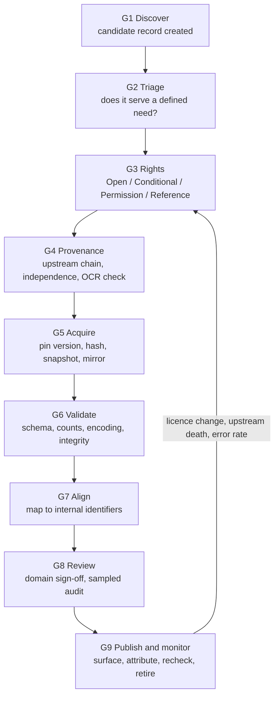

# Resource Intake System

## Quranic Narrative and Evidence Atlas

**Purpose:** turn "we found a useful repository" into a repeatable, auditable pipeline that produces either an ingested, versioned, rights-cleared dataset or a documented rejection.

Companion documents: [QURAN_PRODUCT_STRATEGY.md](QURAN_PRODUCT_STRATEGY.md), [OPEN_RESOURCES_CATALOG.md](OPEN_RESOURCES_CATALOG.md), [DESIGN.md](DESIGN.md).

> The catalog says *what exists*. This document says *how anything gets in*, and how it gets thrown out again.

---

## 1. Why a system instead of a list

A list of open repositories rots. Licences change, repositories are archived, APIs revoke terms, and OCR-derived text propagates errors across dozens of downstream forks that all look independent. Three failure modes are specific to this domain:

1. **Licence laundering.** An MIT-licensed repository wraps copyrighted tafsir or translation text. The code licence is real; it clears nothing about the content.
   - **The harder variant, met in the wild:** a repository that separates its *data* from its code and licences the data **CC0** ? a public-domain dedication, the most permissive statement available ? while naming no source, translator, copyright holder, or edition for content that is plainly a set of modern translations. This is not the code-licence confusion; the licence really does point at the data. It fails for a different reason: **a dedication is only effective if made by the rights holder**, and nothing in the repository establishes that it was. Test: *can this party name what they are waiving rights over, and show why the rights are theirs to waive?* If not, the correctly formed licence file is evidence of intent and nothing else. Discovery tier.
2. **Provenance collapse.** Five popular JSON Quran repositories trace back to two upstream sources, one of which is unattributed OCR. Ingesting all five looks like corroboration. It is not.
3. **Grade drift.** A hadith grade appears in a dataset as a bare string (`sahih`) with no grader, work, edition, or page. Once ingested that way, the attribution can never be reconstructed.

The system below exists to make each of these impossible to do accidentally.

---

## 2. Roles

| Role | Owns | Can block |
|---|---|---|
| Scout | Discovery, first-pass triage, candidate record | ? |
| Rights reviewer | Licence determination, the four-state decision, attribution wording | Any ingest |
| Data engineer | Fetch, hash, transform, align, load, refresh | Any ingest on technical grounds |
| Domain reviewer (Quran / hadith / history / science) | Content accuracy, alignment correctness, grade attribution | Publication |
| Editorial lead | Publication state, corrections, retraction | Publication |

No single person may hold both *rights reviewer* and *editorial lead* for the same resource.

---

## 3. The nine gates

Every candidate resource moves through nine gates in order. A resource may fail at any gate and stop. Nothing skips a gate.



### G1 ? Discover

Create a candidate record. Minimum fields: name, canonical URL, repository, maintainer, last commit or release date, stated licence text (copied verbatim, not summarized), and the scout's one-line claim of what it would contribute.

Standing discovery channels: GitHub topic feeds (`quran`, `hadith`, `islamic`, `arabic-nlp`), Zenodo and Mendeley Data DOIs, OpenAlex and Crossref for dataset papers, university digital-humanities project pages, IIIF manifest registries, and the reference lists of any dataset already ingested.

### G2 ? Triage

Answer three questions in writing. If any answer is weak, stop.

- Which **defined product need** does this serve? Name the surface (Story Canvas, Evidence Desk, Teacher Studio, Quran Reader) and the object (claim, episode, person, qawm, place, event, report, grade, geometry).
- What do we already have that covers this? If an ingested resource covers 80% of it, the candidate must justify the remaining 20%.
- What is the **cost of being wrong** here? A basemap error is cosmetic. A hadith grade error is a retraction.

Triage output is one of: `pursue`, `park` (revisit date required), `reject` (reason required).

### G3 ? Rights

The rights reviewer assigns exactly one of the four states from [OPEN_RESOURCES_CATALOG.md](OPEN_RESOURCES_CATALOG.md) ?1 ? **Open**, **Conditional**, **Permission required**, **Reference only** ? and separately records the licence for each asset class present:

`code ? database rights ? text ? translation ? images ? audio ? fonts ? metadata`

Hard rules:

- A repository-level licence file is evidence about the **repository**, not about third-party content inside it. Where the repository bundles a translation, tafsir, hadith collection, font, or recording, that asset needs its own determination or the resource is capped at **Reference only**.
- An `Unlicense` or `MIT` marking on a repository whose content is a scanned classical book clears the code and nothing else.
- Share-alike terms (CC BY-SA, ODbL, GPL) must be traced to their *derived-work* consequences before ingest, not after. Record explicitly whether the obligation propagates to our database, our exports, or only to that resource's own files.
- Non-commercial terms (CC BY-NC-SA, as used by OpenITI releases) are compatible with internal research and prototypes and incompatible with a paid product surface. Record which side of that line each intended use falls on.
- An API's terms of service govern **storage and redistribution**, not just access. Absence of a stated storage right means no storage right.

Output: the four-state decision, the exact attribution string to display, the modification rules, the recheck date, and the takedown contact.

### G4 ? Provenance

Before acquiring, trace the chain upward until you reach a named edition, a named institution, or a dead end.

Record: upstream source, whether the text is keyed, OCR-derived, or of unknown origin, whether it has been through human proofreading, and which *other* candidate resources share the same upstream.

Two resources sharing an upstream count as **one** piece of evidence. This is recorded on the resource record as `independence_group`, and the alignment stage refuses to treat same-group resources as corroborating.

A resource with an untraceable upstream may still be ingested ? but only into the **discovery** tier (?5), never the publishable tier.

### G5 ? Acquire

- Pin an exact version: release tag, commit SHA, DOI version, or dataset release number. Never track a moving branch.
- Compute and store SHA-256 for every file acquired.
- Snapshot the licence file, README, and terms page **as fetched**, with fetch timestamp, into the source archive. Upstream wording changes; our record of what we agreed to must not.
- Mirror to our own object storage. Never make a production read path depend on a third party's CDN.
- Record fetch method, rate limits observed, and robots/ToS compliance notes.

### G6 ? Validate

Automated, blocking. A resource that fails validation does not proceed regardless of how attractive it is.

| Check | Failure means |
|---|---|
| Encoding is valid UTF-8; normalization form recorded (NFC expected) | Reject or normalize with a recorded transform |
| Arabic diacritics, hamza forms, and alif variants profiled and counted | Encoding variant must be identified before alignment |
| Urdu text renders in Nastaliq without codepoint loss; ZWNJ/ZWJ usage profiled | Fix or reject |
| Record counts match the source's own stated counts | Investigate before proceeding |
| Ayah counts per surah equal 6236 total under the declared numbering scheme | Wrong or mixed numbering scheme |
| Referential integrity: every foreign key resolves | Reject |
| Duplicate detection within the resource | Investigate |
| Diff against any same-`independence_group` resource already held | Confirms or refutes claimed independence |
| Sampled human spot-check, minimum 50 records or 2%, whichever is larger | Error rate above threshold (?7) rejects |

### G7 ? Align

Map external identifiers to internal ones. Alignment is itself data, and it is never silently overwritten.

Every alignment row carries: `external_id ? internal_id`, method (`exact` / `rule` / `fuzzy` / `manual`), confidence, who or what produced it, date, and review state.

- **Quran**: align on surah + ayah under an explicitly declared numbering scheme (Kufan by default), and on token index under the declared morphology source. Word-level alignment across differing orthographies requires a recorded normalization pipeline, not ad-hoc string matching.
- **Hadith**: align on collection + book + chapter + all available numbering systems simultaneously. Never align on a single numbering system ? the deprecated USC-MSA scheme and in-book references diverge and both are in circulation.
- **Narrators**: never merge identities on name similarity alone. Require at least two independent signals (kunya, nasab, death year, teacher/student overlap, city, tabaqa). Unmerged is always safer than wrongly merged; store candidates as `possible_same_as` with confidence rather than collapsing them.
- **Places**: align to Pleiades, GeoNames, and Wikidata identifiers as *external references*, never as an assertion that the ancient place is the Quranic place. That assertion is a separate, reviewable claim with its own evidence and counter-evidence.
- **Grades**: a grade never enters as a string. It enters as an attributed evaluation ? grader, exact wording in the original language, work, edition, page, and date ? or it does not enter.

Anything that cannot be aligned lands in an explicit `unaligned` queue with a reason. The queue is a work item, not a silent drop.

### G8 ? Review

**Revised under the founding decisions.** There is no domain reviewer, and inventing a lighter-weight substitute that sounds like one would be worse than having none. G8 is therefore not a judgement gate. It is a **sampling gate**, and it tests the resource against something checkable rather than against expertise.

Draw a random sample from the resource, size per ?7, and for each item verify it **against the underlying printed or scanned edition** ? not against another digital copy, which usually shares an upstream and so corroborates nothing ([`independence_group`](#)). Record for each: located yes/no, exact match yes/no, discrepancy noted.

What the sample tests:

- alignment correctness ? does the passage sit where the resource says it does;
- **grade attribution completeness ? is every grade traceable to a named critic and a locatable page**, this being the highest-risk field in any hadith resource;
- translation fidelity where applicable;
- whether the resource's declared coverage claim survives contact with the sample.

Recorded with date, sample size, located count, error count, and an explicit scope limitation ? e.g. `cleared for discovery and search; not cleared to establish story beats` ? which is the honest outcome for most resources and should be the common one.

**A resource clears G8 for the uses its sample supports, and no further.** A resource whose sample cannot be verified against a real edition does not clear G8 at all; it stays in Reference-only and may be used to find things, never to assert them.

### G9 ? Publish and monitor

On publish, the resource becomes visible in the source registry UI with its licence, version, attribution, and review state. Every claim it supports links back to it.

Ongoing, automated:

- **Licence recheck** on the cadence set at G3 ? routine for Clear resources, twice as often for anything Conditional or API-based, since those change without notice. Diff the archived licence snapshot against live.
- **Upstream liveness**: last commit, release, archive status, and domain resolution. A dead upstream is not an emergency ? we hold a mirror ? but it freezes the version and triggers a replacement search.
- **Error feedback**: corrections filed by readers and reviewers aggregate per resource. Crossing the threshold in ?7 triggers re-review.

Retirement path: `deprecate` (stop new use, keep existing citations with a notice) ? `retract` (remove from claims, keep the record and the reason). A retracted resource's record is never deleted; deletion would break the audit trail we exist to provide.

---

## 4. The resource manifest

Every resource has one manifest file under version control. This is the machine-readable form of the gates above.

```yaml
id: pleiades-datasets
name: Pleiades gazetteer datasets
canonical_url: https://pleiades.stoa.org/downloads
repository: https://github.com/isawnyu/pleiades.datasets
maintainer: Institute for the Study of the Ancient World, NYU

gate_state: published            # candidate|triaged|rights_cleared|acquired|validated|aligned|reviewed|published|deprecated|retracted

rights:
  state: conditional             # open|conditional|permission_required|reference_only
  licences:
    data: CC-BY-3.0
    code: not_applicable
  attribution: "Pleiades gazetteer, ISAW/NYU, CC BY 3.0. Release {version}."
  modification: permitted_with_notice
  commercial_use: permitted
  share_alike: false
  storage_rights: permitted
  redistribution: permitted_with_attribution
  notify_upstream: pleiades.admin@nyu.edu
  recheck_due: <date>
  licence_snapshot: archive/pleiades-datasets/<snapshot-date>/LICENSE.txt

provenance:
  upstream: live gazetteer at pleiades.stoa.org
  derivation: keyed and community-edited, not OCR
  independence_group: pleiades
  known_forks_ingested: [pleiades-plus]

acquisition:
  version: "3.2"
  pinned_ref: releases/tag/3.2
  fetched: <date>
  formats: [json, csv, rdf-ttl]
  checksums: manifests/pleiades-datasets-3.2.sha256
  mirror: s3://corpus-archive/pleiades-datasets/3.2/

validation:
  passed: true
  record_count: 40000            # verify against release notes at ingest
  sample_reviewed: 200
  error_rate: 0.0

alignment:
  targets: [place]
  method: external_reference_only
  note: >
    Pleiades identifiers attach to place records as external references.
    They never assert that an ancient site is the Quranic location; that is
    a separate claim with its own evidence and reviewers.

review:
  reviewer: null
  date: null
  scope: "geography reference layer; not evidence for Quranic identification"

tier: publishable                # publishable|discovery|reference_only
```

---

## 5. Three tiers, three storage zones

Physical separation, not a flag on a row. This is the single most important structural decision in the intake system, because it makes "unclear material leaked into the published product" a schema violation rather than an editorial mistake.

| Tier | What lives here | Can it appear on a public page? | Examples |
|---|---|---|---|
| **Publishable** | Rights-cleared, provenance-traced, domain-reviewed | Yes, with attribution | Tanzil Arabic text, MASAQ morphology, cleared EN/UR translations, Natural Earth, Pleiades references |
| **Discovery** | Useful for search, alignment, and finding things; not quotable | No ? it may *lead* an editor to a source, never *be* the source | Aggregator JSON repos, OCR-derived corpora, OpenITI (NC terms), large hadith dumps, unresolved narrator sets |
| **Reference only** | Consulted and linked, never copied | Link only | Quran.com frontend, AlTafsir, subscription databases |

The publishable zone has no foreign keys pointing into discovery. A claim cannot cite a discovery-tier row. The promotion path from discovery to publishable runs through G7 and G8 with a named reviewer, or it does not happen.

---

## 6. Ingest scorecard

Scored at G2 and re-scored at G8. Used to sequence work, not to override any gate.

| Dimension | 0 | 1 | 2 | 3 |
|---|---|---|---|---|
| Rights clarity | Unknown | Permission required | Conditional | Open |
| Provenance | Untraceable | Named but unverified | Named edition | Named edition + institutional custody |
| Independence | Duplicate of held resource | Shared upstream | Partly independent | Fully independent |
| Coverage of a defined need | Marginal | Partial | Substantial | Fills a stated gap |
| Structural quality | Flat text | Structured, no IDs | Stable IDs | Stable IDs + versioning + schema |
| Maintenance | Dead | Dormant | Active | Active + releases + issue response |
| Correction cost if wrong | Retraction risk | Public correction | Internal fix | Cosmetic |

Guidance: score ?15 with rights clarity ?2 ? schedule for ingest. Score 10?14 ? discovery tier. Score <10 ? park or reject. Rights clarity of 0 blocks ingest at any total.

---

## 7. Error thresholds

Fixed in advance so that no one negotiates them while under pressure to ship.

| Content class | Sampled error rate that blocks ingest | Post-publication rate that triggers re-review |
|---|---|---|
| Quran Arabic text | 0 ? any discrepancy blocks | 0 |
| Quran translation alignment | 0.1% | 0.05% |
| Hadith text and numbering | 0.5% | 0.2% |
| Grade attribution completeness | 0 missing grader/work/locator | 0 |
| Narrator identity merges | 1% false merge | 0.5% |
| Historical and geographic claims | 2% | 1% |
| Basemap and cosmetic layers | 5% | 5% |

---

## 8. Automation

What runs without a human, and what must never run without one.

**Automated:** fetch and mirror, checksum verification, encoding and normalization profiling, count reconciliation, referential-integrity checks, duplicate and cross-resource diffing, licence-page diffing on the recheck schedule, upstream liveness polling, unaligned-queue generation, attribution-string rendering, and export-manifest generation.

**Assisted, never autonomous:** candidate alignment proposals, narrator-identity candidate pairs, translation-discrepancy flags, and summarization of a source passage for editorial triage. Every one of these produces a *proposal* with confidence that a named human accepts or rejects.

**Never automated:** the rights determination, the hadith grade, the Quran translation, the decision that a story beat is established, the identification of a Quranic place with an archaeological site, and publication.

This mirrors the AI policy in [QURAN_PRODUCT_STRATEGY.md](QURAN_PRODUCT_STRATEGY.md): the assistant may find, align, and draft; it may not grade, translate scripture, invent citations, or publish.

---

## 9. Repository layout

```text
corpus/
  sources/
    <resource-id>/
      manifest.yaml            # ?4
      archive/<date>/          # licence, README, terms as fetched
      raw/<version>/           # untouched acquired files + .sha256
      normalized/<version>/    # after recorded transforms only
      transforms/              # every transform as reviewable code
      alignment/               # external_id -> internal_id + method + confidence
      validation/              # reports per run
      review/                  # sign-offs, sample audits, scope limits
  registry/
    resources.yaml             # index; drives the public source registry UI
    independence_groups.yaml
    attribution.yaml           # rendered strings per surface and language
```

`raw/` is append-only. Any correction is a transform in `transforms/` producing a new `normalized/` version, never an edit to `raw/`.

---

## 10. Opening intake queue

Sequenced by dependency, not by attractiveness. No dates ? each wave starts when the wave before it clears its gates.

**Wave 1 ? foundation, publishable tier**

1. Tanzil Arabic text ? full nine gates. This is the spine; nothing aligns without it.
2. MASAQ v4 morphology ? pin the DOI version, align token indices against Tanzil, record the discrepancy report.
3. Natural Earth ? basemap, trivially cleared, unblocks all map work.

**Wave 2 ? bilingual and structural**

4. One English and one Urdu translation pair, cleared in writing. Rights first; do not build UI against an uncleared translation.
5. Pleiades + GeoNames + Wikidata as external reference layers only.
6. Corpus Coranicum TEI into discovery tier for textual history.
7. Quranic Arabic Corpus ontology into discovery tier as an ontology cross-check pending its licence interpretation.

**Wave 3 ? hadith programme and evidence depth**

8. Open-Hadith-Data into discovery tier as an Arabic alignment base; derived-database obligations reviewed before any export.
9. Sanadset 650K and Itqan's narrator set into discovery tier for isnad and rijal research. Neither supplies publishable grades.
10. Sunnah.com ? open the partnership conversation for cross-check and storage rights. Do not scrape.
11. OpenITI / KITAB into discovery tier under its non-commercial terms, scoped to internal research.
12. First end-to-end vertical slice: one story dossier where every claim traces to a publishable-tier source, to prove the pipeline before scaling it.

**Explicitly not in any of these waves:** any aggregator JSON repository as a source of record, any OCR-derived tafsir as publishable text, any hadith grade taken from a dataset string, and any archaeological identification presented as established.

---

## 11. What the system refuses

A short list, kept short so it is remembered:

- No moving branches. Pin a version or do not ingest.
- No content right inferred from a code licence.
- No grade without grader, work, edition, and locator.
- No narrator merge on name similarity alone.
- No same-upstream resources counted as corroboration.
- No claim citing a discovery-tier row.
- No edit to `raw/`.
- **No publication of any claim whose verification ledger entry is not `located: yes`.** This replaces the reviewer sign-off, which no longer exists. It is the harder gate of the two: a reviewer could approve something on judgement, but `located: yes` means someone opened the cited edition and found the page, and a stranger can repeat the check.
- Nothing invented, ever ? see [roadmap ?0](./ROADMAP.md). A report, grade, page, or date that cannot be located does not exist for this product's purposes.
